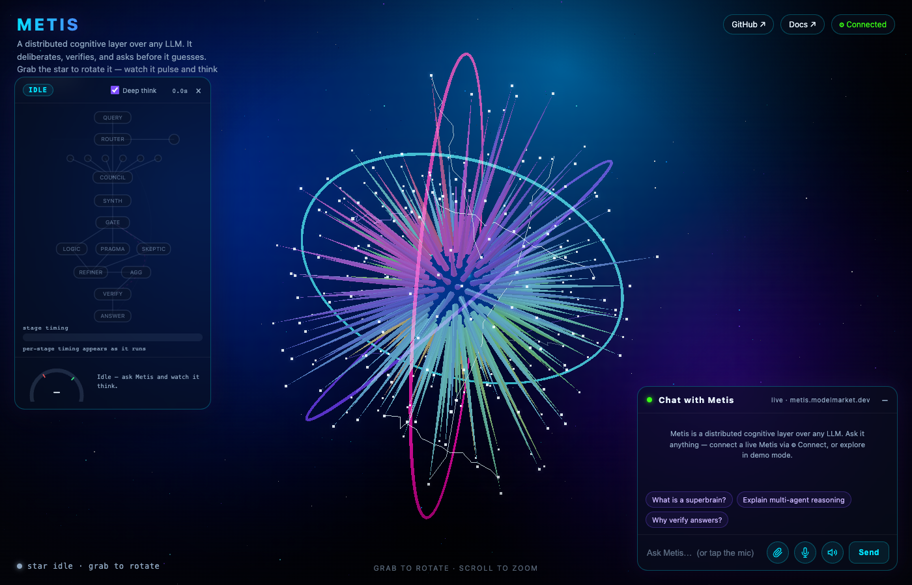
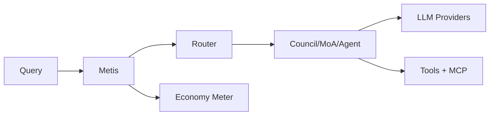

<!-- aicom-mirror-notice -->
> **📖 Read-only mirror.** `metis` is published from the canonical AI-Factory monorepo.
> **Pull requests are not accepted** — any commit pushed here is overwritten by
> `scripts/mirror_satellites.sh` on the next sync.
> 🐞 Found a bug or have a request? Please **[open an issue](https://github.com/alexar76/metis/issues)**.

<!-- aicom-readme-badges -->
<p align="center">
  <a href="https://github.com/alexar76/metis/actions/workflows/ci.yml"></a>
  <a href="https://github.com/alexar76/metis/actions/workflows/pages.yml"></a>
  <a href="https://alexar76.github.io/metis/"></a>
  <a href="https://metis.modelmarket.dev/"></a>
  
  
  <a href="docs/badges/coverage.svg"></a>
  <a href="LICENSE"></a>
</p>
<!-- /aicom-readme-badges -->

# Metis

<p align="center">
  <a href="https://github.com/alexar76/metis/actions/workflows/ci.yml"></a>
  
  
  
  
  
</p>

<p align="center">
  <strong>Metis</strong> (μῆτις) — distributed cognitive layer over any LLM<br/>
  Part of the <a href="https://github.com/alexar76">alexar76</a> AI agent economy
</p>

<p align="center">
  <a href="https://metis.modelmarket.dev/">
    
  </a>
  <br>
  <sub>Grab the star · watch it pulse and think · chat with Metis — <a href="https://metis.modelmarket.dev/"><b>open the live demo →</b></a></sub>
</p>

🌐 **Language:** **English** · [Русский](docs/ru/README.md) · [Español](docs/es/README.md)

**Multi-agent reasoning orchestrator** — Understanding Council, DGPD depth gating, layered MoA, verifier, memory, search, economy metering, distributed cluster, MCP tools, and OpenAI-compatible API.

## Quick start

```bash
python3 -m venv .venv && source .venv/bin/activate
pip install -e ".[dev,distributed]"
ollama pull qwen3:8b
metis "Explain multi-agent systems" --model qwen3:8b --url http://localhost:11434/v1
```

## Documentation index

| Resource | Link |
|----------|------|
| **Architecture** | [EN](docs/en/ARCHITECTURE.md) · [RU](docs/ru/ARCHITECTURE.md) · [ES](docs/es/ARCHITECTURE.md) |
| **API reference** | [EN](docs/en/API.md) · [RU](docs/ru/API.md) · [ES](docs/es/API.md) |
| **Deployment** | [EN](docs/en/DEPLOYMENT.md) · [RU](docs/ru/DEPLOYMENT.md) · [ES](docs/es/DEPLOYMENT.md) |
| **Security** | [EN](docs/en/SECURITY.md) · [RU](docs/ru/SECURITY.md) · [ES](docs/es/SECURITY.md) |
| **User guide** | [EN](docs/en/README.md) · [RU](docs/ru/README.md) · [ES](docs/es/README.md) |
| **Distributed** | [EN](docs/en/DISTRIBUTED.md) · [RU](docs/ru/DISTRIBUTED.md) · [ES](docs/es/DISTRIBUTED.md) |
| **Ecosystem** | [EN](docs/en/ECOSYSTEM.md) · [RU](docs/ru/ECOSYSTEM.md) · [ES](docs/es/ECOSYSTEM.md) |
| **Research** | [EN](docs/en/RESEARCH.md) · [RU](docs/ru/RESEARCH.md) · [ES](docs/es/RESEARCH.md) |
| **Wiki** | [Home](wiki/Home.md) · [Quick Start](wiki/Quick-Start.md) · [FAQ](wiki/FAQ.md) |
| **Landing page** | [Live demo](https://metis.modelmarket.dev/) · [docs/landing/index.html](docs/landing/index.html) · [deploy guide](docs/landing/README.md) |
| **Changelog** | [CHANGELOG.md](CHANGELOG.md) · [RELEASE.md](RELEASE.md) |

## Ecosystem map

| Project | Role |
|---------|------|
| **[Metis](https://github.com/alexar76/metis)** | Cognitive orchestration layer (this repo) |
| **[cognitive-runtime](https://github.com/alexar76/cognitive-runtime)** | OpenAI API wrapper with DGPD |
| **[ARGUS-3](https://github.com/alexar76/argus)** | Demand-side reference agent + WARDEN MCP firewall |
| **[AIMarket Hub](https://github.com/alexar76/aimarket-hub)** | Federated capability catalog and invoke API |
| **[aimarket-oracle-gateway](https://github.com/alexar76/aimarket-oracle-gateway)** | Verifiable oracle MCP services |
| **[HELIOS](https://github.com/alexar76/helios)** | Broadcast pipeline for ecosystem content |
| **[AICOM](https://github.com/alexar76/aicom)** | AI-Factory — autonomous product pipeline |

## CLI commands

| Command | Purpose |
|---------|---------|
| `metis` | Run a query through the cognitive stack |
| `metis-serve` | OpenAI-compatible API (`/v1/chat/completions`) |
| `metis-node` | Start a distributed worker node |
| `metis-coordinator` | Start the cluster coordinator |
| `metis-cluster` | Check cluster node health |

## Architecture



## Production

```bash
export METIS_API_KEY=sk-...
metis-serve --config config.production.yaml --production --port 8080
```

Legacy env vars `SUPERBRAIN_*` and `COGNITIVE_*` are still read for one release cycle.

## Docker

```bash
cp config/docker.env.example .env
docker compose up -d --build
```

## Tests

```bash
pytest --cov=metis --cov-report=term-missing -v
```

## Research citations

Design decisions are grounded in published work — see [docs/en/RESEARCH.md](docs/en/RESEARCH.md) for Yang et al. 2026 (heterogeneous agents), Wang et al. ICLR 2025 (layered MoA), and related citations with honest caveats.

MIT License
