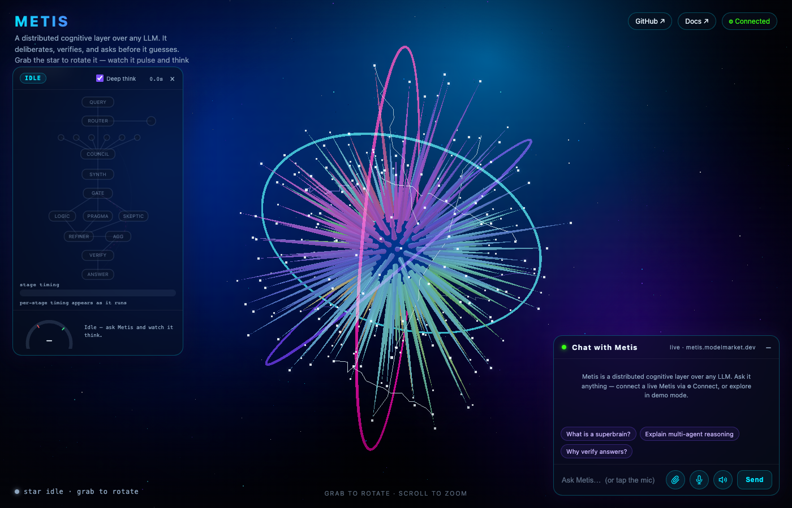
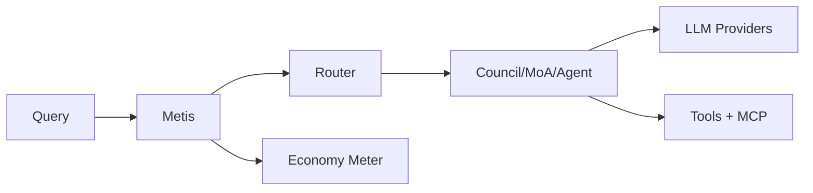

<!-- aicom-mirror-notice -->
> **🔄 Synced from a monorepo — but with a live history.** `metis` mirrors the
> canonical AI-Factory monorepo. History here is append-only (no force-push).
> **Pull requests are welcome** — merged PRs are imported back into the monorepo
> and re-synced here, so your contribution becomes canonical.
> 💬 **[Issues](https://github.com/alexar76/metis/issues)** · **[Pull requests](https://github.com/alexar76/metis/pulls)** both welcome.

# Metis

<!-- aicom-readme-badges -->
<p align="center">
  <a href="https://github.com/alexar76/metis/actions/workflows/ci.yml"></a>
  <a href="https://pypi.org/project/aimarket-metis/"></a>
  
  
  
  <a href="https://metis.modelmarket.dev/"></a>
  <a href="https://raw.githubusercontent.com/alexar76/metis/refs/heads/main/docs/badges/coverage.svg"></a>
  <a href="https://github.com/alexar76/metis/blob/main/LICENSE"></a>
</p>
<!-- /aicom-readme-badges -->

<!-- markers above: the GitHub mirror regenerates this block in place (no duplicate row). -->


<p align="center">
  <strong>Metis</strong> (μῆτις) — distributed cognitive layer over any LLM<br/>
  Part of the <a href="https://github.com/alexar76">alexar76</a> AI agent economy
</p>

<p align="center">
  <a href="https://metis.modelmarket.dev/">
    
  </a>
  <br>
  <sub>Grab the star · watch it pulse and think · chat with Metis — <a href="https://metis.modelmarket.dev/"><b>open the live demo →</b></a></sub>
</p>

> 🌐 **English** · [Русский](README.ru.md) · [Español](README.es.md) · [Français](README.fr.md) · [中文](README.zh.md) · [Glossary](https://github.com/alexar76/aicom/blob/main/docs/localization-glossary.md)

**Multi-agent reasoning orchestrator** — Understanding Council, DGPD depth gating, layered MoA, verifier, memory, search, economy metering, distributed cluster, MCP tools, and OpenAI-compatible API.

## Quick start

```bash
python3 -m venv .venv && source .venv/bin/activate
pip install -e ".[dev,distributed]"
ollama pull qwen3:8b
metis "Explain multi-agent systems" --model qwen3:8b --url http://localhost:11434/v1
```

## Install

PyPI package name is **`aimarket-metis`** (the PyPI name `metis` is a different project). Import path and CLI stay **`metis`**, **`metis-serve`**, etc.

```bash
# PyPI
pip install aimarket-metis
pip install "aimarket-metis[dev,distributed]"

# GitHub release tag
pip install "aimarket-metis[distributed] @ git+https://github.com/alexar76/metis.git@v0.2.0"

# Clone / monorepo (editable)
git clone https://github.com/alexar76/metis.git && cd metis
pip install -e ".[dev,distributed]"

# Docker
docker compose up -d
```

## Documentation index

| Resource | Link |
|----------|------|
| **Architecture** | [EN](docs/en/ARCHITECTURE.md) · [RU](docs/ru/ARCHITECTURE.md) · [ES](docs/es/ARCHITECTURE.md) |
| **API reference** | [EN](docs/en/API.md) · [RU](docs/ru/API.md) · [ES](docs/es/API.md) |
| **Deployment** | [EN](docs/en/DEPLOYMENT.md) · [RU](docs/ru/DEPLOYMENT.md) · [ES](docs/es/DEPLOYMENT.md) |
| **Security** | [EN](docs/en/SECURITY.md) · [RU](docs/ru/SECURITY.md) · [ES](docs/es/SECURITY.md) |
| **User guide** | [EN](docs/en/README.md) · [RU](docs/ru/README.md) · [ES](docs/es/README.md) |
| **Distributed** | [EN](docs/en/DISTRIBUTED.md) · [RU](docs/ru/DISTRIBUTED.md) · [ES](docs/es/DISTRIBUTED.md) |
| **Ecosystem** | [EN](docs/en/ECOSYSTEM.md) · [RU](docs/ru/ECOSYSTEM.md) · [ES](docs/es/ECOSYSTEM.md) |
| **Research** | [EN](docs/en/RESEARCH.md) · [RU](docs/ru/RESEARCH.md) · [ES](docs/es/RESEARCH.md) |
| **Wiki** | [Home](wiki/Home.md) · [Quick Start](wiki/Quick-Start.md) · [FAQ](wiki/FAQ.md) |
| **Landing page** | [Live demo](https://metis.modelmarket.dev/) · [docs/landing/index.html](docs/landing/index.html) · [deploy guide](docs/landing/README.md) |
| **Changelog** | [CHANGELOG.md](CHANGELOG.md) · [RELEASE.md](RELEASE.md) |

## Ecosystem map

| Project | Role |
|---------|------|
| **[Metis](https://github.com/alexar76/metis)** | Cognitive orchestration layer (this repo) |
| **cognitive-runtime** | OpenAI API wrapper with DGPD |
| **[ARGUS-3](https://github.com/alexar76/argus)** | Demand-side reference agent + WARDEN MCP firewall |
| **[AIMarket Hub](https://github.com/alexar76/aimarket-hub)** | Federated capability catalog and invoke API |
| **[aimarket-oracle-gateway](https://github.com/alexar76/aimarket-oracle-gateway)** | Verifiable oracle MCP services |
| **[aimarket-mcp](https://github.com/alexar76/aimarket-mcp)** | Shared MCP gateway — web fetch/search + Metis verify ([Glama](https://glama.ai/mcp/servers/alexar76/aimarket-mcp)) |
| **[Ecosystem landing](https://modeldev.modelmarket.dev)** | Full AICOM map — Metis, MCP servers, oracles, ARGUS |
| **[HELIOS](https://github.com/alexar76/helios)** | Broadcast pipeline for ecosystem content |
| **[AICOM](https://github.com/alexar76/aicom)** | AI-Factory — autonomous product pipeline |

## CLI commands

| Command | Purpose |
|---------|---------|
| `metis` | Run a query through the cognitive stack |
| `metis-serve` | OpenAI-compatible API (`/v1/chat/completions`) |
| `metis-node` | Start a distributed worker node |
| `metis-coordinator` | Start the cluster coordinator |
| `metis-cluster` | Check cluster node health |

## Architecture


```mermaid
flowchart LR
    Q["Query"] --> M["Metis"]
    M --> R["Router"]
    R --> C["Council/MoA/Agent"]
    C --> P["LLM Providers"]
    C --> T["Tools + MCP"]
    M --> E["Economy Meter"]
```

## Jury verification (`/v1/verify`)

By default a `/v1/verify` verdict is written by one model and audited by one model — the
base model on `fast`, the MoA aggregator on `council`. That is the verdict the AIMarket
hub's [Pay-on-Verified](https://github.com/alexar76/aimarket-hub/blob/main/docs/pay-on-verified.md) escrow moves money on,
so a seller only has to fool one lineage. A **jury** makes it a vote across vendors:

```yaml
jury_default_for_verify: true   # every /v1/verify goes to the jury; off → only route: "jury"
jury_min_vendors: 3             # and every seat must be a different vendor
jury_models:
  - {model: deepseek-v4-pro, base_url: https://api.deepseek.com/v1, api_key_env: DEEPSEEK_API_KEY}
  - {model: minimax/minimax-m3, base_url: https://openrouter.ai/api/v1, api_key_env: OPENROUTER_API_KEY}
  - {model: z-ai/glm-5.3, base_url: https://openrouter.ai/api/v1, api_key_env: OPENROUTER_API_KEY}
```

Ready rosters for both courts are in [`deploy/prod.jury.example.yaml`](deploy/prod.jury.example.yaml).

What the jury does, and what it promises:

- The caller's prompt goes to every juror **unchanged**, in parallel, at `jury_temperature`
  (0.1). A juror slower than `jury_timeout_seconds` abstains; it does not hold the jury.
- A juror's vote counts only if it states `{"fulfils": bool, "score": 0–1}` consistently
  at the caller's bar and — when the request carries `audit_id` — echoes that id. A juror
  that parroted a verdict planted in the audited text has not voted.
- A side wins with a strict majority of the **whole roster**; abstentions count against
  agreement. `verify_score` = agreement × median confidence of the winning side
  (confidence in "fulfils" = score, in "does not fulfil" = 1 − score), so a confident
  unanimous conviction is a *trusted* audit.
- `answer` is one winning juror's verdict object on its own, so a consumer's parser reads
  it unchanged. A split carries no verdict object (indeterminate); every seat failing is
  `status: "error"` (retry), never a verdict.
- The envelope adds `jury` (`[{model, vendor, fulfils, score, latency_ms, abstained?}]`),
  `jury_outcome` (`pass|fail|split|unavailable`), `jury_agreement` and
  `input_flags.injection_suspected`. The trace resolves at `/v1/traces/{trace_id}`.
- Injection-looking text is **flagged, not blocked** on this path: the audited text is
  written by the parties with money on the verdict, and a hard block would hand either of
  them an indeterminate outcome on demand.

Know the arithmetic before sizing a roster: at the hub's 0.7 bar a 3-seat jury settles only
when unanimous (2/3 × anything < 0.7); five seats tolerate one confident dissent; an even
roster only adds splits. The jurors are independent *labs*, not independent
infrastructure — seats behind one gateway share its outages and its account.

The same change stops the capability gate from seating one model as both the writer and
the auditor of a verdict: with `judge_distinct_vendor: true` (default) the judge avoids the
vendors of the base model and the MoA aggregator, an explicit `modules.judge` that clears
`min_aggregator_capability` is honoured instead of silently overridden, and
`min_unique_council_vendors` extends the diversity check from (model, endpoint) pairs to
vendors, for the MoA seats as well as the council. `metis validate` warns when the judge
still shares a vendor with a writer.

### Running a second instance as the appeal court

The hub's appeal path (`AIMARKET_APPEAL_WINDOW_S`) re-judges a disputed verdict on a
**second, independent** Metis. Independence is operational, so it has to be set up that way:

1. **Another host.** Not the first instance's machine (shared failure, shared operator
   access) and not a host holding a hot wallet. Same image, its own container.
2. **A disjoint jury.** The `metis_2` roster in `deploy/prod.jury.example.yaml` shares no
   vendor with `metis_1` (a test enforces it). Use a second OpenRouter key with its own
   spend cap — vendor-disjoint seats behind one key still share that key's quota.
3. **Its own identity.** Its own `METIS_API_KEY` (setting it makes `/v1/verify` require
   the Bearer), handed to the hub as `AIMARKET_APPEAL_METIS_KEY`; its own
   `AIMARKET_APPEAL_METIS_URL`; and a distinct `AIMARKET_APPEAL_VERIFIER_ID` (e.g.
   `metis.appeal@v1`) so every envelope and receipt names which court decided.
4. **Nothing from the first instance.** It gets the stored intent and delivery, a fresh
   audit id and the appellant's fenced statement — never the first verdict, its score, its
   reasons or its trace. Do not point it at the first instance's trace store or knowledge
   store.

```bash
docker run -d --name metis-appeal --restart unless-stopped -p 127.0.0.1:8081:8080 \
  -e METIS_API_KEY=<appeal-court key> -e OPENROUTER_API_KEY=<second, capped key> \
  -v /opt/metis-appeal/prod.yaml:/app/config/prod.yaml:ro -v /opt/metis-appeal/data:/app/data \
  metis:latest metis-serve --host 0.0.0.0 --port 8080 --config /app/config/prod.yaml
```

## Production

```bash
export METIS_API_KEY=sk-...
metis-serve --config config.production.yaml --production --port 8080
```

Legacy env vars `SUPERBRAIN_*` and `COGNITIVE_*` are still read for one release cycle.

## Docker

```bash
cp config/docker.env.example .env
docker compose up -d --build
```

## Tests

```bash
pytest --cov=metis --cov-report=term-missing -v
```

## Research citations

Design decisions are grounded in published work — see [docs/en/RESEARCH.md](docs/en/RESEARCH.md) for Yang et al. 2026 (heterogeneous agents), Wang et al. ICLR 2025 (layered MoA), and related citations with honest caveats.

MIT License
