# Metis Architecture

**Version 0.2.0** · [MIT License](https://opensource.org/licenses/MIT) · Multi-agent reasoning orchestrator over any LLM

Metis is the **reasoning and orchestration layer** in the [alexar76 ecosystem](ECOSYSTEM.md). It wraps any model endpoint — local Ollama, OpenAI-compatible APIs, Anthropic, or distributed worker nodes — with a structured cognitive stack: Understanding Council, Disagreement-Gated Pipeline Depth (DGPD), layered Mixture-of-Agents (MoA), tool/MCP execution, verification, memory, economy metering, and production security.

Metis is **API-only** (no bundled chat UI). Clients connect via the OpenAI-compatible `/v1/chat/completions` endpoint, the Python `Metis` class, or the `metis` CLI. Use VS Code Continue, Cursor, or `curl` against the serve endpoint.

---

## Table of Contents

1. [Design Principles](#design-principles)
2. [System Overview](#system-overview)
3. [Query-to-Answer Data Flow](#query-to-answer-data-flow)
4. [Core Components](#core-components)
   - [Metis Exoskeleton](#metis-exoskeleton)
   - [Router](#router)
   - [Understanding Council](#understanding-council)
   - [Confidence Gate](#confidence-gate)
   - [DGPD — Pipeline Depth L0–L3](#dgpd--pipeline-depth-l0l3)
   - [Layered Mixture-of-Agents](#layered-mixture-of-agents)
   - [Verifier](#verifier)
   - [Agent Loop](#agent-loop)
   - [Memory and RAG](#memory-and-rag)
   - [Search Pipeline](#search-pipeline)
   - [Tool Registry](#tool-registry)
   - [MCP Integration](#mcp-integration)
5. [Distributed Cluster](#distributed-cluster)
6. [Economy and Billing](#economy-and-billing)
7. [Security Layers](#security-layers)
8. [OpenAI-Compatible API](#openai-compatible-api)
9. [IDE Integration](#ide-integration)
10. [Module Registry and Providers](#module-registry-and-providers)
11. [Ecosystem Integration](#ecosystem-integration)
12. [Configuration Reference](#configuration-reference)
13. [Component Tables](#component-tables)
14. [Related Documentation](#related-documentation)

---

## Design Principles

| Principle | Implementation |
|-----------|----------------|
| **Model-agnostic** | Every brain module resolves to a `ModelSlot` — Ollama, OpenAI-compat, Anthropic, or remote node |
| **Fail-closed understanding** | Confidence gate blocks expensive solve paths when `TaskSpec` confidence or ambiguity is insufficient |
| **Disagreement-gated depth** | DGPD escalates pipeline cost only when parallel agents disagree |
| **Security never skipped** | Injection scan, sensitive-keyword gates, and canary tokens force L3 on risky input |
| **Untrusted boundaries** | Tool and MCP output wrapped in `<untrusted>` delimiters; SSRF protection on outbound HTTP |
| **Observable spend** | Per-call usage metering with session budget gates and webhook export |
| **Observable pipeline** | Structured JSON logs, trace_id per request, module spans, audit log |
| **Runtime learning** | KnowledgeStore + ExperienceReplay — council reads similar past TaskSpecs |

---

## Knowledge Flow (v0.2)

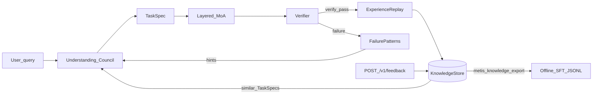

---

## System Overview

The `Metis` class (aliases `CognitiveExoskeleton`, `Superbrain`) is the single orchestration entry point. It owns working, episodic, and vector memory; builds the builtin tool registry; optionally loads MCP tools; and wires economy metering around every `run()` call.

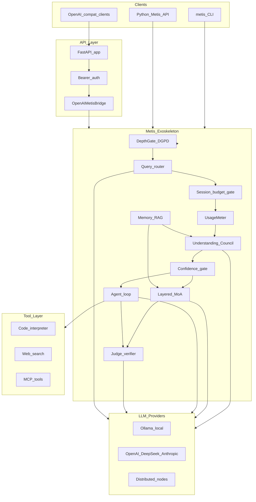

---

## Query-to-Answer Data Flow

Every request passes through sanitization, routing, optional budget check, and route-specific execution. Successful council/agent runs may persist to long-term vector memory.

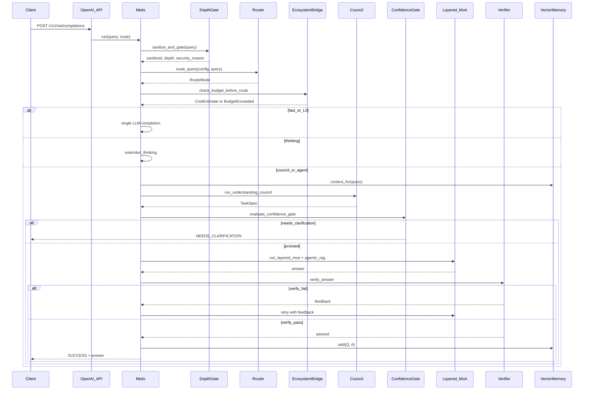

### Run status values

| Status | Meaning |
|--------|---------|
| `success` | Answer produced (verifier may have warnings after max retries) |
| `needs_clarification` | Confidence gate or council flagged unresolved ambiguities |
| `error` | Budget exceeded or unrecoverable failure |

---

## Core Components

### Metis Exoskeleton

`metis/exoskeleton.py` defines `Metis`, the orchestration class. Key responsibilities:

- **Initialization** — creates `WorkingMemory`, `EpisodicMemory`, `VectorMemory`, builtin `ToolRegistry`, `DepthGate`, `EscalationPolicy`, and optional `EcosystemBridge`
- **`run(query, route=None)`** — sanitizes input, routes, meters usage, delegates to `_execute`, finalizes economy report
- **Route handlers** — `_run_fast`, `_run_thinking`, `_run_council`, `_run_agent`

```python
# Primary entry point
result = await Metis(config).run("Explain CAP theorem", route=RouteMode.COUNCIL)
```

`ExoskeletonResult` carries `answer`, `status`, `route`, `task_spec`, `verify_score`, `depth`, `clarifications`, and `metadata` (usage, security_reason, proposer_agreement, etc.).

### Router

`metis/router/classifier.py` selects among four `RouteMode` values when `default_route: council`:

| Mode | When |
|------|------|
| `fast` | Factual, low ambiguity, no tools |
| `thinking` | Reasoning without tools — extended chain-of-thought |
| `agent` | Coding, search, APIs, oracle/MCP markers |
| `council` | Planning, high ambiguity, multi-step tasks |

The router LLM (`router` module role) returns JSON with `mode`, `task_type`, and `scores`. Deterministic overrides apply when `tools_needed ≥ 7` or `ambiguity ≥ 7`. Oracle/ecosystem markers (`oracle`, `vdf`, `verifiable`, etc.) route to `agent` when MCP tools are enabled. A heuristic fallback runs if the router LLM fails.

### Understanding Council

`metis/agents/council.py` runs **six parallel isolated agents** (no peer visibility — reduces sycophantic drift), then a synthesizer:

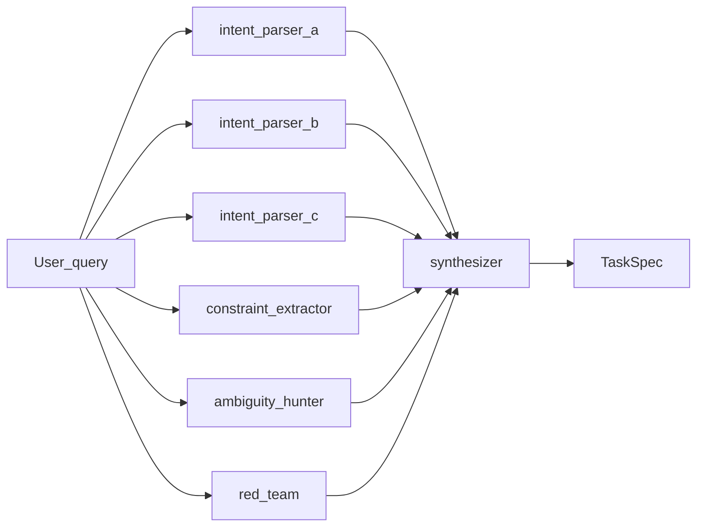

| Agent | Role |
|-------|------|
| `intent_parser_a/b/c` | Parallel intent interpretation (heterogeneous models when configured) |
| `constraint_extractor` | Explicit and implicit constraints, format requirements |
| `ambiguity_hunter` | Alternative readings and unresolved issues |
| `red_team` | Adversarial interpretation — traps and wrong readings |
| `synthesizer` | Merge into a single `TaskSpec` with confidence score |

Output is a `TaskSpec` (`metis/schemas/task_spec.py`) — the contract between understanding and solving:

| Field | Purpose |
|-------|---------|
| `goal` | What the user wants as output |
| `constraints` / `non_goals` | Boundaries and exclusions |
| `ambiguities` | Issues requiring resolution or user input |
| `success_criteria` | How to judge a correct answer |
| `required_tools` | `code`, `search`, or none |
| `confidence` | 0–1 synthesizer confidence |

### Confidence Gate

`metis/gates/` evaluates a composite score from `TaskSpec.confidence`, ambiguity penalties, and structural bonuses **before** MoA or agent execution. When `enforce_confidence_gate: true` (default), a low composite score or unresolved ambiguities return `NEEDS_CLARIFICATION` with `clarification_questions()` — a fail-closed gate, not a correctness guarantee.

Composite score formula:

```
composite = clamp(confidence - ambiguity_penalty + criteria_bonus + constraint_bonus, 0, 1)
```

| Signal | Effect |
|--------|--------|
| Unresolved ambiguity (`needs_user_input`) | −0.1 each |
| `success_criteria` present | +0.05 |
| `constraints` present | +0.03 |
| Below `confidence_hard_floor` (0.35) | `CLARIFY` |
| Below `confidence_threshold` (0.7) | `CLARIFY` |

### DGPD — Pipeline Depth L0–L3

**Disagreement-Gated Pipeline Depth** (`metis/pipeline/`) skips expensive layers when parallel agents agree. Security-sensitive queries always escalate to L3.

| Level | Enum | Baseline LLM calls | Pipeline behavior |
|-------|------|-------------------|-------------------|
| **L0** | `L0_FAST` | 1 | Single completion — `fast` route or simple query |
| **L1** | `L1_QUICK_CONSENSUS` | 4 | Quick consensus path — `thinking` route |
| **L2** | `L2_STANDARD` | 8 | MoA proposers; **refiner skipped** when agreement ≥ threshold |
| **L3** | `L3_FULL` | 14 | Full MoA (propose → refine → aggregate) + verify retries |

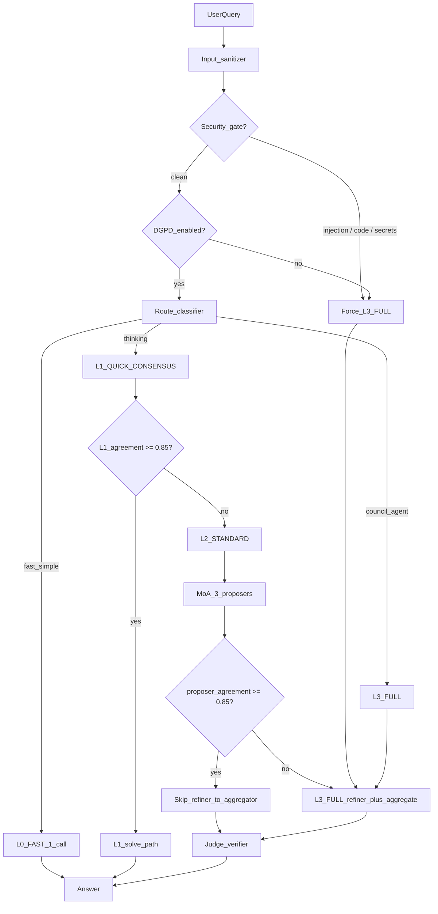

**Agreement scoring** (`metis/pipeline/agreement.py`):

- Council parsers: weighted blend of goal similarity (0.5), constraint Jaccard (0.35), ambiguity penalty (0.15)
- MoA proposers: pairwise normalized text similarity via `SequenceMatcher`

**Escalation** (`metis/pipeline/escalation.py`): `after_l1_consensus` and `after_l2_proposers` compare agreement to `dgpd.agreement_threshold` (default 0.85). L2 proposer disagreement triggers L3 mid-pipeline via `_escalation.after_l2_proposers()`.

**Force-full-depth triggers** (never skipped):

- `dgpd.force_full_depth_keywords`: delete, execute, password, api key, secret, production, deploy
- Code execution patterns: `run code`, `python`, `bash`, `eval(`
- Sensitive patterns: password, api_key, secret, token, credential
- Injection detection when `enforce_injection_scan: true`

**Calls saved** — `DepthGate.calls_saved(chosen)` reports baseline savings vs L3 (14 calls).

### Layered Mixture-of-Agents

`metis/agents/moa.py` implements a three-layer MoA (Wang et al., ICLR 2025):

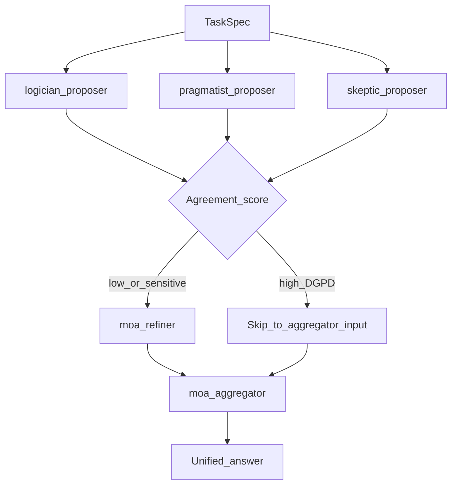

| Layer | Module roles | Role |
|-------|-------------|------|
| 1 | `moa_proposer_logician`, `moa_proposer_pragmatist`, `moa_proposer_skeptic` | Parallel diverse proposals (temp 0.7) |
| 2 | `moa_refiner` | Merge strengths; skipped at L2 when proposers agree |
| 3 | `moa_aggregator` | Final unified answer aligned to TaskSpec (temp 0.3) |

Heterogeneous model enforcement (`enforce_heterogeneous_agents`, `min_unique_council_models`) warns or errors when ensemble diversity is weak. Research basis: Yang et al. (2026) — diversity over homogeneous scale.

### Verifier

`metis/verify/critic.py` runs the `judge` module against the TaskSpec contract:

1. Does the answer achieve the **goal**?
2. Are **constraints** respected?
3. Are **non_goals** avoided?
4. Are **success_criteria** met?

Returns `Verdict(passed, score, feedback)`. Council path retries up to `max_verify_retries` (default 3) with judge feedback injected into MoA prompts. Optional self-consistency pass (`thinking_samples > 1`) runs before verification on hard tasks.

### Agent Loop

`metis/agents/loop.py` implements **Plan → Act → Observe → Reflect** for `RouteMode.AGENT`:

1. **Plan** — decompose task into steps (JSON)
2. **Act** — `agentic_tool_step` decides tool use or direct answer
3. **Observe** — record tool results in `EpisodicMemory`
4. **Reflect** — assess progress; `continue`, `retry`, or `finish`

Runs up to `max_agent_iterations` (default 5). MCP tools load lazily via `_ensure_mcp_tools()` before agent execution. Agent route always runs at `DepthLevel.L3_FULL`.

### Memory and RAG

`metis/memory/store.py` provides three tiers:

| Tier | Class | Scope | Storage |
|------|-------|-------|---------|
| Working | `WorkingMemory` | Current session | In-memory turns + scratchpad (max 20 turns, last 10 in context) |
| Episodic | `EpisodicMemory` | Current session tool attempts | In-memory action/outcome log |
| Long-term | `VectorMemory` | Cross-session | JSON file (`data/memory/vectors.json`) with TF-IDF retrieval |

`metis/rag/agentic.py` performs **agentic RAG** on council path:

1. Decompose query into 1–3 sub-queries
2. Iteratively search `VectorMemory` (up to 2 iterations)
3. Synthesize answer with document citations `[1]`, `[2]`

Successful council/agent answers are persisted to long-term memory when `enable_long_term_memory: true`.

### Search Pipeline

Web search is a first-class tool, not a separate microservice. The search pipeline runs inside the agent loop or as a direct tool invocation.

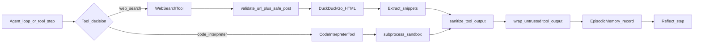

| Step | Module | Notes |
|------|--------|-------|
| URL validation | `security/ssrf.py` | Blocks private IPs, localhost, metadata endpoints |
| HTTP fetch | `safe_post` | Manual redirect validation per hop (max 3) |
| Output sanitization | `security/injection.py` | Truncate to 50 KB; wrap in `<untrusted>` |
| Metering | `economy/meter.py` | `record_mcp_tool` for latency tracking |

Default search URL: `https://html.duckduckgo.com/html/` (configurable via `web_search_url`).

### Tool Registry

`metis/tools/registry.py` centralizes tool execution:

| Builtin tool | Class | Description |
|-------------|-------|-------------|
| `code_interpreter` | `CodeInterpreterTool` | Python via `metis.tools.sandbox` subprocess (timeout configurable) |
| `web_search` | `WebSearchTool` | DuckDuckGo HTML scrape with SSRF protection |

`ToolRegistry.execute()` sanitizes successful output and records MCP/tool latency on the active `UsageMeter`. `agentic_tool_step()` drives JSON-based tool-or-answer decisions in the agent loop.

### MCP Integration

`metis/mcp/` bridges external MCP servers into `ToolRegistry`:

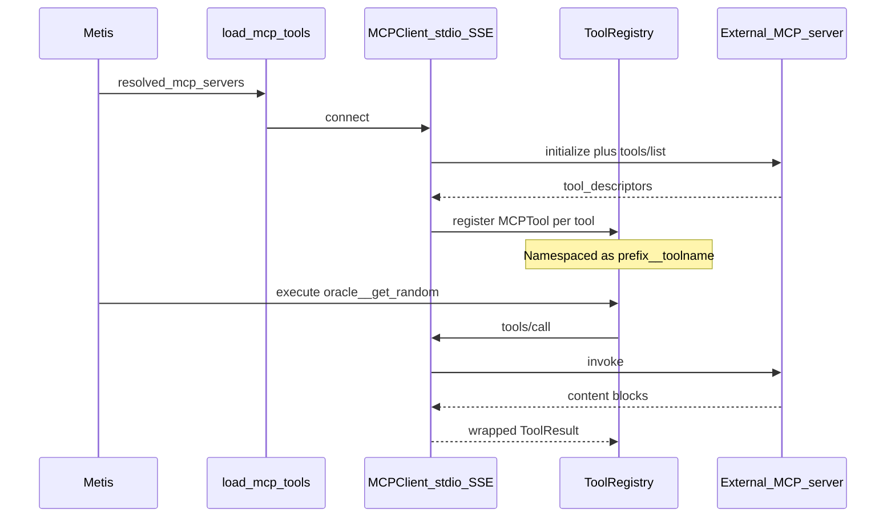

| Transport | Client | Config |
|-----------|--------|--------|
| stdio | `MCPClient` | `command` + `args` |
| SSE | `MCPSSEClient` | `url` |

**Ecosystem presets** (`mcp_ecosystem_presets`):

| Preset | Tools | Prefix |
|--------|-------|--------|
| `aimarket-oracle-gateway` | 35 verifiable oracle tools | `oracle__` |
| `aimarket-plugins` | 15 hub plugins | `hub__` |

---

## Distributed Cluster

When `distributed: true` and `cluster_config` is set, brain modules with `node_id` route through `RemoteLLMProvider` instead of local `create_provider`.

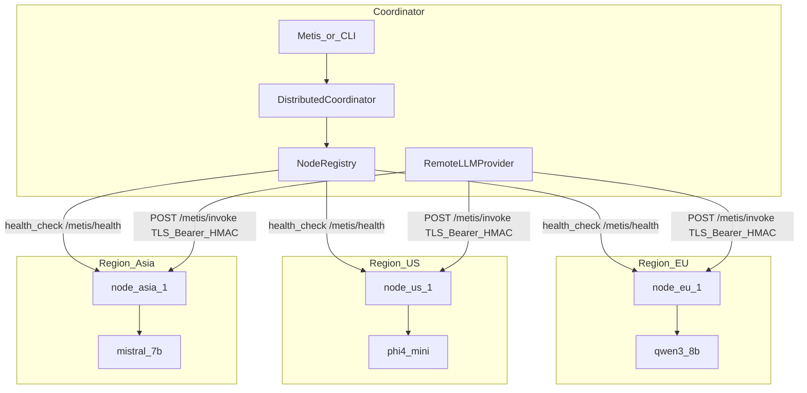

**Worker node server** (`metis/distributed/server.py`):

| Endpoint | Purpose |
|----------|---------|
| `GET /metis/health` | Health probe — returns models, roles, version |
| `POST /metis/invoke` | Secure RPC — `InvokeRequest` → `InvokeResponse` |
| `POST /v1/chat/completions` | OpenAI-compat proxy on the node |

**Node resolution** (`NodeRegistry.resolve_for_slot`): explicit `node_id` → role match → model match → healthy failover. `failover_candidates` excludes failed nodes and prefers role/model matches.

**Cross-node security**: Bearer token (`METIS_NODE_*_KEY`), optional HMAC request signing (`X-Metis-Timestamp`, `X-Metis-Signature`), TLS verification, rate limiting, 512 KB body limit, structured audit logs without prompt content.

**DistributedCoordinator** (`metis/distributed/coordinator.py`) dispatches parallel agent calls across nodes and can run MoA layers with proposers on different workers.

See [DISTRIBUTED.md](DISTRIBUTED.md) for production cluster setup.

---

## Economy and Billing

The economy layer aligns with alexar76 **pay-per-call** metering ([AIMarket Hub](https://github.com/alexar76/aimarket-hub), oracle gateway).

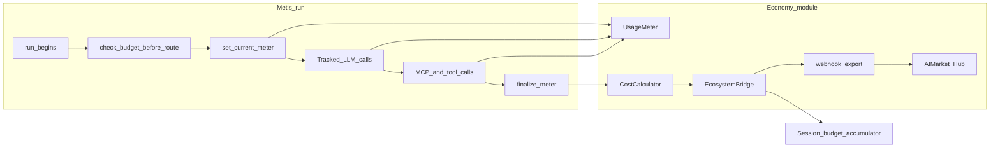

| Component | Module | Responsibility |
|-----------|--------|----------------|
| `UsageMeter` | `economy/meter.py` | Context-var scoped per-run event collection |
| `CostCalculator` | `economy/cost.py` | Token-based cost from `economy.models` pricing table |
| `EcosystemBridge` | `economy/bridge.py` | Budget gate, finalize, webhook POST |
| `TrackedProvider` | `economy/tracked.py` | Wraps LLM providers to record token/latency events |

**Budget gate**: when `economy.enabled` and `session_budget_usd` are set, routes in `require_budget_for_routes` (default: `council`, `agent`) are blocked if the estimated cost would exceed the session cap — raises `BudgetExceededError`.

**Route cost estimates** (for pre-flight checks):

| Route | Estimated LLM calls |
|-------|---------------------|
| `fast` | 1 |
| `thinking` | 2 |
| `agent` | 6 |
| `council` | 12 |

Usage reports attach to `result.metadata["usage"]` as `UsageReport.to_dict()`.

---

## Security Layers

Defense in depth across input, transport, tool output, and distributed RPC.

```mermaid
flowchart TB
    subgraph inputLayer [Input_Layer]
        Sanitize[sanitize_user_input]
        InjectionScan[injection_pattern_scan]
        RoleStrip[role_marker_removal]
        Canary[canary_token_injection]
        Truncate[max_user_input_chars]
    end

    subgraph promptLayer [Prompt_Layer]
        SysPrompt[build_system_prompt]
        Boundary[SECURITY_BOUNDARY_rules]
        UntrustedWrap[wrap_untrusted_delimiters]
    end

    subgraph networkLayer [Network_Layer]
        SSRF[validate_url]
        SafeHTTP[safe_get_safe_post]
        RedirectCheck[per_hop_redirect_validation]
    end

    subgraph apiLayer [API_Layer]
        BearerAuth[Bearer_API_key]
        RateLimit[token_bucket_limiter]
        BodyLimit[max_request_body_bytes]
        CORS[cors_origins_lockdown]
    end

    subgraph distLayer [Distributed_Layer]
        TLS[TLS_verification]
        HMAC[HMAC_request_signing]
        mTLS[optional_mTLS]
        Audit[audit_log_no_PII]
    end

    UserInput[User_input] --> Sanitize
    Sanitize --> InjectionScan
    InjectionScan -->|"detected"| ForceL3[Force_L3_depth]
    Sanitize --> SysPrompt
    SysPrompt --> Boundary
    ToolOutput[Tool_MCP_output] --> UntrustedWrap

    WebSearch[Outbound_HTTP] --> SSRF
    SSRF --> SafeHTTP
    SafeHTTP --> RedirectCheck

    APIRequest[API_request] --> BearerAuth
    BearerAuth --> RateLimit
    RateLimit --> BodyLimit

    NodeRPC[Node_RPC] --> TLS
    TLS --> HMAC
    HMAC --> Audit
```

| Control | Default | Config key |
|---------|---------|------------|
| Max user input | 100,000 chars | `security.max_user_input_chars` |
| Max tool output | 50,000 chars | `security.max_tool_output_chars` |
| Max request body | 512,000 bytes | `security.max_request_body_bytes` |
| Injection scan | enabled | `security.enforce_injection_scan` |
| Rate limit | 60 req/min, burst 10 | `security.rate_limit` |
| CORS | empty (deny) | `security.cors_origins` |
| mTLS | optional | `security.mtls_cert_path`, `mtls_key_path`, `mtls_ca_path` |

**Injection patterns** detected in `security/injection.py`: ignore previous instructions, jailbreak, role spoofing, system tag injection, and similar adversarial markers.

Security events log via `log_security_event()` — structured JSON without prompt content, API keys, or secrets.

---

## OpenAI-Compatible API

`metis/api/` exposes a FastAPI application compatible with OpenAI chat completions.

| Endpoint | Handler | Notes |
|----------|---------|-------|
| `GET /health` | `app.py` | Service health |
| `GET /v1/models` | `openai_compat.py` | Lists `metis`, `metis-fast`, `metis-thinking`, `metis-council`, `metis-agent` |
| `POST /v1/chat/completions` | `openai_compat.py` | Sync or SSE streaming |

**Model → route mapping** (`api/bridge.py`):

| Model | Route |
|-------|-------|
| `metis` | Auto (classifier) |
| `metis-fast` | `fast` |
| `metis-thinking` | `thinking` |
| `metis-council` | `council` |
| `metis-agent` | `agent` |

Legacy aliases `superbrain-*` are supported.

**Authentication** (`api/auth.py`): Bearer token required when `METIS_PRODUCTION=true` or `METIS_API_KEY` is set. Accepts `METIS_API_KEY`, `SUPERBRAIN_API_KEY`, or `COGNITIVE_API_KEY`.

**Start server**:

```bash
export METIS_API_KEY=sk-your-secret-key
export METIS_PRODUCTION=true
metis-serve --host 0.0.0.0 --port 8080 --config config.yaml
```

Or set `METIS_CONFIG_PATH` for YAML-based config loading.

---

## IDE Integration

Metis has no bundled UI. IDEs connect as OpenAI-compatible clients.

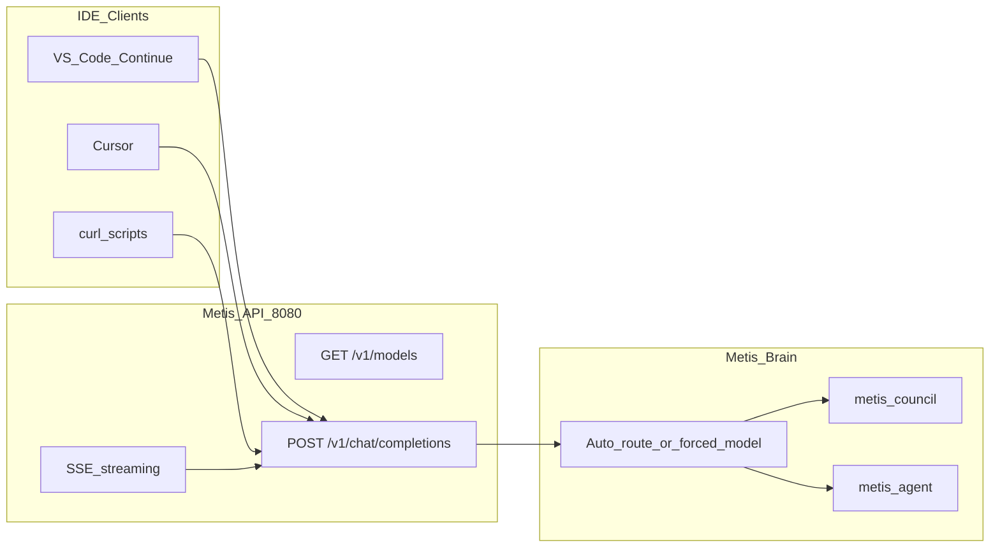

### VS Code (Continue)

```json
{
  "models": [{
    "title": "Metis Council",
    "provider": "openai",
    "model": "metis-council",
    "apiBase": "http://localhost:8080/v1",
    "apiKey": "your-key"
  }]
}
```

### Cursor

1. **Settings → Models**
2. Enable **Override OpenAI Base URL** → `http://localhost:8080/v1`
3. Set API key to your `METIS_API_KEY`

### curl

```bash
curl -s http://localhost:8080/v1/chat/completions \
  -H "Content-Type: application/json" \
  -H "Authorization: Bearer sk-your-secret-key" \
  -d '{
    "model": "metis-council",
    "messages": [{"role": "user", "content": "Explain async/await in Python"}]
  }'
```

---

## Module Registry and Providers

`metis/modules/registry.py` maps brain roles to `ModelSlot` configurations. Unconfigured roles fall back to `base_model` / `base_url`.

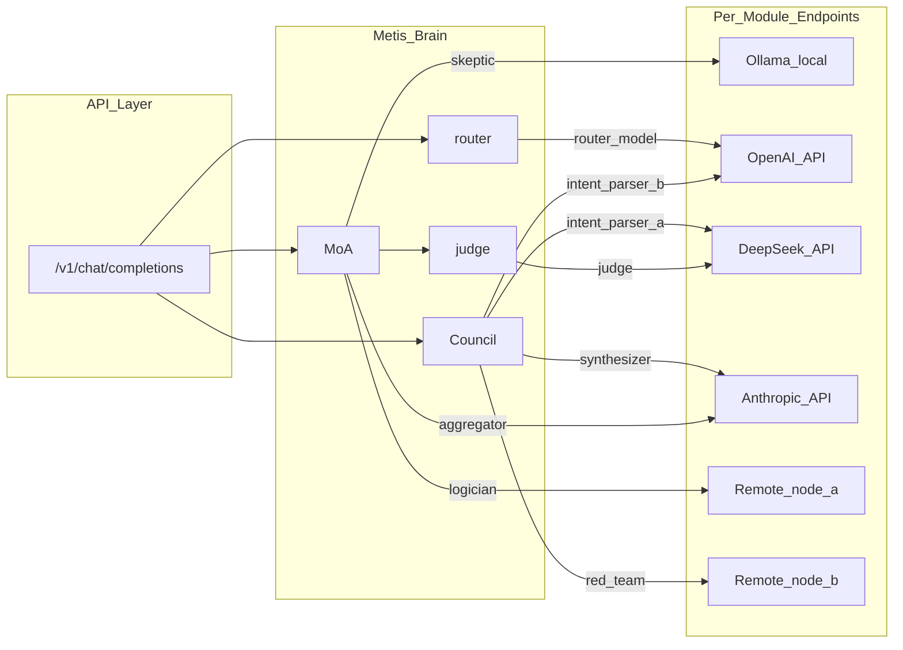

### Provider matrix

| Provider | `provider` value | Typical `base_url` | Notes |
|----------|------------------|-------------------|-------|
| Ollama (local) | `ollama` | `http://localhost:11434/v1` | Free local inference |
| OpenAI | `openai_compat` | `https://api.openai.com/v1` | GPT models |
| DeepSeek | `openai_compat` | `https://api.deepseek.com/v1` | OpenAI-compatible |
| Anthropic | `anthropic` | (native API) | Claude models |
| Distributed node | `openai_compat` | node URL | Set `node_id` + `cluster_config` |
| vLLM / LiteLLM | `openai_compat` | your proxy URL | Any OpenAI-compatible proxy |

Validate and inspect:

```bash
metis config validate -c config.yaml
metis config show-modules -c config.yaml
```

---

## Ecosystem Integration

Metis sits in the **reasoning layer** between raw LLM endpoints and demand-side agents.

| Repository | Role | Metis relationship |
|------------|------|-------------------|
| [cognitive-runtime](https://github.com/alexar76/cognitive-runtime) | Prior exoskeleton reference implementation | Shared DGPD, council, and MoA concepts; Metis is the production successor |
| [argus](https://github.com/alexar76/argus) | Demand-side agent with payments | Uses Metis as reasoning backend; WARDEN MCP filters |
| [aimarket-hub](https://github.com/alexar76/aimarket-hub) | Marketplace and usage metering | Webhook export via `economy.webhook_url` and `aimarket_hub_url` |
| [aimarket-oracle-gateway](https://github.com/alexar76/aimarket-oracle-gateway) | Verifiable oracle MCP tools (oracles) | `mcp_ecosystem_presets: [aimarket-oracle-gateway]` — 35 pay-per-call tools |
| [aimarket-plugins](https://github.com/alexar76/aimarket-plugins) | Hub plugin MCP server | `mcp_ecosystem_presets: [aimarket-plugins]` |

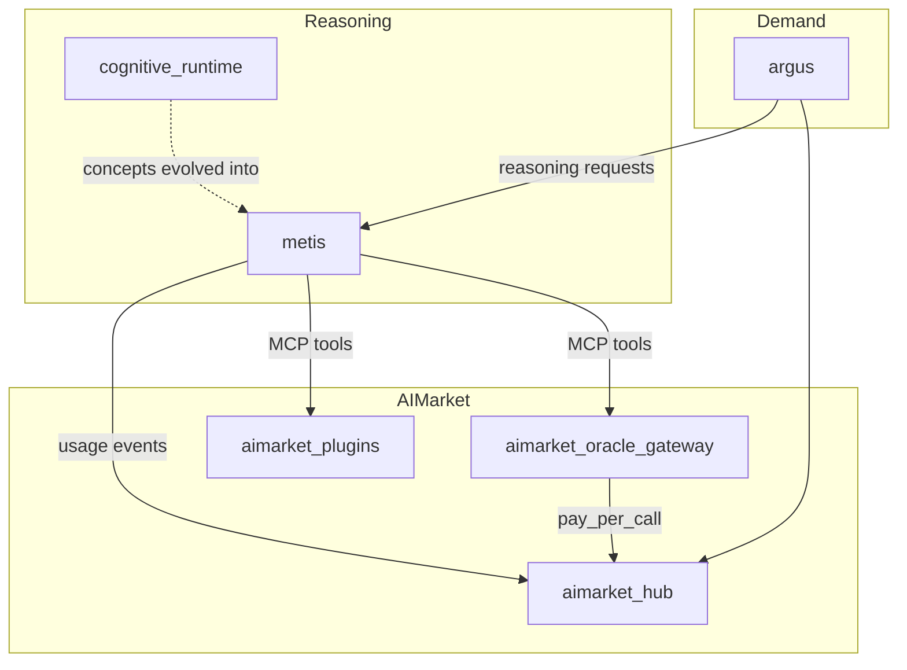

Full ecosystem map: [ECOSYSTEM.md](ECOSYSTEM.md).

---

## Configuration Reference

### Top-level `RuntimeConfig`

| Key | Type | Default | Description |
|-----|------|---------|-------------|
| `production` | bool | `false` | Enforce production security |
| `base_model` | str | `qwen3:8b` | Fallback model |
| `base_url` | str | `http://localhost:11434/v1` | Fallback endpoint |
| `provider` | enum | `ollama` | `openai_compat`, `ollama`, `anthropic` |
| `default_route` | enum | `council` | `fast`, `thinking`, `agent`, `council` |
| `thinking_samples` | int | `3` | Self-consistency sample count |
| `thinking_temperature` | float | `0.8` | Self-consistency temperature |
| `max_agent_iterations` | int | `5` | Agent loop cap |
| `max_verify_retries` | int | `3` | Verifier retry cap |
| `confidence_threshold` | float | `0.7` | Confidence gate threshold |
| `confidence_hard_floor` | float | `0.35` | Fail-closed floor |
| `enforce_confidence_gate` | bool | `true` | Mandatory gate |
| `enforce_heterogeneous_agents` | bool | `false` | Error on weak diversity |
| `min_unique_council_models` | int | `2` | Minimum unique models |
| `memory_dir` | path | `data/memory` | Vector memory directory |
| `enable_long_term_memory` | bool | `true` | TF-IDF vector store |
| `rag_top_k` | int | `5` | RAG retrieval count |
| `enable_code_interpreter` | bool | `true` | Builtin sandbox tool |
| `enable_web_search` | bool | `true` | Builtin search tool |
| `code_timeout_seconds` | int | `10` | Code interpreter timeout |
| `web_search_url` | str | DuckDuckGo HTML | Search endpoint |
| `enable_mcp_tools` | bool | `false` | Load MCP servers |
| `distributed` | bool | `false` | Enable remote providers |
| `cluster_config` | path | — | Cluster YAML path |

### DGPD config (`dgpd:`)

| Key | Default | Description |
|-----|---------|-------------|
| `enabled` | `true` | Enable disagreement-gated depth |
| `agreement_threshold` | `0.85` | Skip refiner / stay at L2 when above |
| `force_full_depth_keywords` | delete, execute, password, api key, secret, production, deploy | Always escalate to L3 |

### Economy config (`economy:`)

| Key | Default | Description |
|-----|---------|-------------|
| `enabled` | `false` | Enable metering and budget |
| `currency` | `USD` | Cost currency |
| `session_budget_usd` | — | Per-session spend cap |
| `require_budget_for_routes` | `council`, `agent` | Routes subject to budget gate |
| `webhook_url` | — | Usage report POST target |
| `aimarket_hub_url` | — | Hub integration URL |
| `export_events` | `true` | Log usage events |
| `models` | `{}` | Per-model `input_per_1m` / `output_per_1m` pricing |

### Security config (`security:`)

| Key | Default | Description |
|-----|---------|-------------|
| `max_user_input_chars` | `100000` | Input truncation |
| `max_tool_output_chars` | `50000` | Tool output cap |
| `max_request_body_bytes` | `512000` | API body cap |
| `enforce_injection_scan` | `true` | Pattern-based injection detection |
| `rate_limit.requests_per_minute` | `60` | Token bucket rate |
| `rate_limit.burst` | `10` | Burst allowance |
| `cors_origins` | `[]` | Allowed CORS origins |

### Per-module config (`modules:`)

```yaml
modules:
  intent_parser_a:
    provider: openai_compat
    model: deepseek-chat
    base_url: https://api.deepseek.com/v1
    api_key_env: DEEPSEEK_API_KEY
    temperature: 0.5
    node_id: node-eu-1

  synthesizer:
    provider: anthropic
    model: claude-sonnet-4-20250514
    api_key_env: ANTHROPIC_API_KEY

  judge:
    model: deepseek-chat
    base_url: https://api.deepseek.com/v1
    api_key_env: DEEPSEEK_API_KEY
```

### Environment variables

| Variable | Purpose |
|----------|---------|
| `METIS_API_KEY` | API authentication |
| `METIS_PRODUCTION` | Require API key |
| `METIS_CONFIG_PATH` | YAML config for serve |
| `METIS_MAX_REQUEST_BYTES` | API body limit override |
| `METIS_RATE_LIMIT_PER_MINUTE` | API rate limit |
| `METIS_HMAC_SECRET` | Distributed request signing |
| `METIS_NODE_*_KEY` | Per-node Bearer tokens |

---

## Component Tables

### Brain module roles

| Role | Pipeline stage |
|------|----------------|
| `intent_parser_a/b/c` | Understanding Council — parallel interpretation |
| `constraint_extractor` | Council — constraints |
| `ambiguity_hunter` | Council — ambiguities |
| `red_team` | Council — adversarial reading |
| `synthesizer` | Council — TaskSpec merge |
| `moa_proposer_logician/pragmatist/skeptic` | MoA layer 1 |
| `moa_refiner` | MoA layer 2 |
| `moa_aggregator` | MoA layer 3 |
| `judge` | Verifier |
| `router` | Query classifier |

### Package layout

| Package | Responsibility |
|---------|----------------|
| `metis/exoskeleton.py` | Main orchestrator |
| `metis/agents/` | Council, MoA, agent loop, diversity |
| `metis/pipeline/` | DGPD depth, agreement, escalation |
| `metis/verify/` | Judge verifier |
| `metis/memory/` | Working, episodic, vector memory |
| `metis/rag/` | Agentic RAG |
| `metis/tools/` | Tool registry, sandbox, web search |
| `metis/mcp/` | MCP client, registry, ecosystem presets |
| `metis/distributed/` | Coordinator, nodes, remote provider, protocol |
| `metis/economy/` | Metering, cost, budget bridge |
| `metis/security/` | Injection, SSRF, rate limit, audit |
| `metis/api/` | OpenAI-compatible FastAPI |
| `metis/modules/` | Per-role provider registry |
| `metis/router/` | Query classifier |
| `metis/gates/` | Confidence gate |
| `metis/models/` | LLM provider abstraction |

### Reliability expectations (honest)

| Mechanism | Guarantee level |
|-----------|-----------------|
| Confidence gate | Likely — early stop, not correctness guarantee |
| Verifier + retry | Likely — judge is still an LLM |
| Heterogeneous MoA (≥2 models) | Likely with real diversity |
| MCP tool transport | Guaranteed for tool access |
| Injection sanitization | Likely — reduces attack surface |
| Session budget gate | Guaranteed for spend caps |
| DGPD depth skip | Guaranteed cost reduction on agreement |

---

## Related Documentation

- [API.md](API.md) — OpenAI-compatible endpoint reference
- [DISTRIBUTED.md](DISTRIBUTED.md) — Multi-node cluster setup
- [ECOSYSTEM.md](ECOSYSTEM.md) — alexar76 integration map
- [RESEARCH.md](RESEARCH.md) — Citations for diversity and MoA
- [BENCHMARKS.md](BENCHMARKS.md) — Performance measurements
- [NAMING.md](NAMING.md) — Metis / Superbrain naming history
