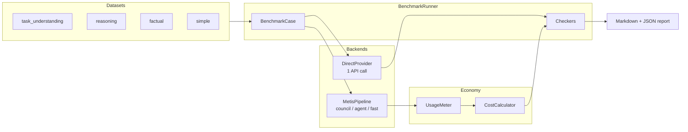

# Benchmarks — Direct API vs Metis

Compare **single direct LLM calls** against the full **Metis exoskeleton** (understanding council, confidence gate, MoA, verifier) on the same models and prompts.

## Quick start

```bash
cd metis
pip install -e ".[dev]"

# Offline (CI-safe, mock provider)
metis-benchmark run --mock --dataset simple --compare direct,metis

# DeepSeek live comparison
export DEEPSEEK_API_KEY=sk-...
metis-benchmark run --models deepseek-chat --dataset all --compare direct,metis \
  --output reports/bench-$(date +%Y%m%d).md

# Multiple models
metis-benchmark run --models deepseek-chat,gpt-4o-mini,qwen3:8b --dataset all

# List what's available
metis-benchmark list-models
metis-benchmark list-datasets
```

## What we measure

| Metric | Description |
|--------|-------------|
| **Latency (ms)** | Wall-clock per case |
| **Tokens in/out** | From provider usage or estimates |
| **Estimated cost (USD)** | Via Metis economy `CostCalculator` |
| **Calls count** | Direct = 1; Metis = metered LLM events |
| **Depth level** | Route estimate (fast=1 … council=12) |
| **Pass rate** | Per-case checkers (see datasets) |

Checkers include `must_ask_clarification`, `answer_contains`, `answer_regex`, `status_success`, and `min_answer_length`.

## Datasets

| File | Category | Cases | Intent |
|------|----------|------:|--------|
| `task_understanding.jsonl` | trap, ambiguous | 12 | Metis should clarify before acting |
| `reasoning.jsonl` | reasoning | 12 | Verifiable math/logic answers |
| `factual.jsonl` | factual | 10 | Static world knowledge |
| `simple.jsonl` | simple | 10 | Trivial — Direct should be faster |

## Example report

| Model | Runner | Cases | Pass rate | Avg latency (ms) | Avg cost (USD) | Avg calls |
|-------|--------|------:|----------:|-----------------:|---------------:|----------:|
| deepseek-chat | direct | 44 | 82% | 890 | 0.000120 | 1.0 |
| deepseek-chat | metis | 44 | 91% | 12400 | 0.001450 | 8.2 |
| qwen3:8b | direct | 44 | 80% | 210 | 0.000000 | 1.0 |
| qwen3:8b | metis | 44 | 88% | 3200 | 0.000000 | 7.5 |

Reports also include **Where Metis wins** and **Where Direct wins** sections — computed honestly from pass rates and latency by category.

## Benchmark flow



## Interpretation guide

### When Metis should beat Direct

- **Ambiguous / trap prompts** — confidence gate should ask clarifying questions instead of guessing.
- **Multi-step reasoning** — council + verifier can catch errors a single shot misses.
- **Code / agent tasks** (future datasets) — tool loop benefits from structured `TaskSpec`.

### When Direct should beat Metis

- **Simple FAQ** — one call is enough; council overhead adds latency and cost without quality gain.
- **Tight latency SLOs** — Metis makes multiple sequential LLM calls by design.
- **Cost-sensitive batch** — pass rate gains may not justify 5–12× token spend.

### Honest expectations

- Metis will **not** win every category. The report highlights real deltas.
- Factual cases run with **web search disabled** in the default benchmark config; both runners rely on model knowledge.
- Missing API keys skip models gracefully — CI mock tests never require secrets.

## Hybrid model diversity (`config/test-hybrid.yaml`)

Compare single-model benchmarks against the heterogeneous module config:

| Tier | Model | Example roles | Input $/1M | Output $/1M |
|------|-------|---------------|----------:|------------:|
| Flash | `deepseek-v4-flash` | router, judge, fast parsers | 0.14 | 0.28 |
| Pro | `deepseek-v4-pro` | synthesizer, red_team, logician | 0.435 | 0.87 |
| Local | `phi-4-reasoning-plus` | `intent_parser_b` (LM Studio) | 0 | 0 |

```bash
export METIS_BASE_URL=https://api.deepseek.com/v1

# Single-tier baselines (simple dataset)
metis-benchmark run --models deepseek-v4-flash --dataset simple --compare direct
metis-benchmark run --models deepseek-v4-pro --dataset simple --compare direct

# Full hybrid stack (per-module routing)
metis config show-modules -c config/test-hybrid.yaml
metis --route council -c config/test-hybrid.yaml "Your query"
```

See `config/TEST_SETUP.md` for smoke tests and LM Studio prerequisites.

## Environment variables

| Variable | Provider |
|----------|----------|
| `DEEPSEEK_API_KEY` | `deepseek-chat`, `deepseek-v4-pro`, `deepseek-v4-flash` @ `api.deepseek.com` |
| `OPENAI_API_KEY` | `gpt-4o-mini` @ `api.openai.com` |
| `METIS_BASE_URL` | Override base URL for ad-hoc benchmark model ids (e.g. `https://api.deepseek.com/v1`) |
| _(none)_ | `qwen3:8b` via local Ollama |

## CI

- `pytest -m benchmark` — mock harness tests (no keys).
- `.github/workflows/benchmark.yml` — **manual dispatch only**; runs live benchmarks when secrets are configured.
