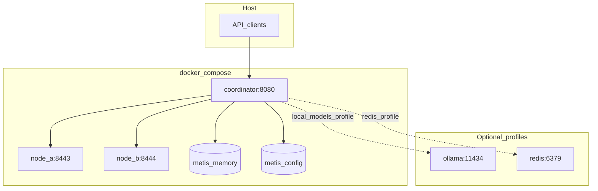
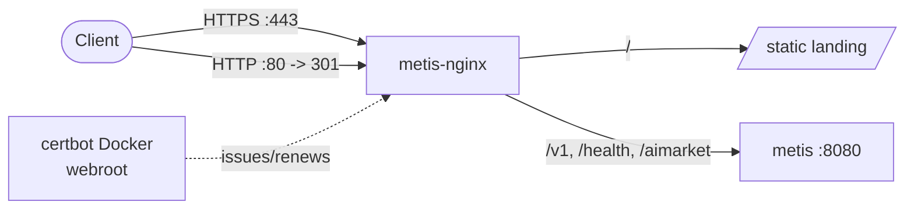

# Metis Deployment Guide

**Version 0.1.0** · Docker, production configuration, secrets, and scaling

---

## Table of Contents

1. [Quick Start](#quick-start)
2. [Docker Architecture](#docker-architecture)
3. [Dockerfile](#dockerfile)
4. [Docker Compose Stack](#docker-compose-stack)
5. [Production Configuration](#production-configuration)
6. [Secrets Management](#secrets-management)
7. [Environment Variables](#environment-variables)
8. [Health Checks](#health-checks)
9. [Scaling](#scaling)
10. [Native Deployment](#native-deployment)
11. [Related Documentation](#related-documentation)

---

## Quick Start

```bash
# 1. Copy and configure secrets
cp .env.example .env
# Edit .env — set METIS_API_KEY, provider API keys, node keys

# 2. Build and start the stack
docker compose up -d --build

# 3. Verify
curl -s http://localhost:8080/health
curl -s http://localhost:8080/v1/models \
  -H "Authorization: Bearer $METIS_API_KEY"
```

The default stack runs a **coordinator** plus **two worker nodes** (`node-a`, `node-b`) on an internal bridge network. The coordinator exposes port `8080`; worker nodes are internal-only.

---

## Docker Architecture



| Service | Role | Exposed port |
|---------|------|--------------|
| `coordinator` | OpenAI API + distributed routing | `8080` |
| `node-a` | Worker LLM node | internal `8443` |
| `node-b` | Worker LLM node | internal `8444` |
| `ollama` | Local inference (profile `local-models`) | internal `11434` |
| `redis` | Optional cache (profile `redis`) | internal `6379` |

---

## Dockerfile

Multi-stage build (`python:3.11-slim`):

| Stage | Purpose |
|-------|---------|
| `builder` | Install gcc, build wheel with `[distributed]` extras |
| `runtime` | Non-root `metis` user (uid/gid 1000), curl for healthchecks |

**Security defaults in image:**

- `METIS_PRODUCTION=true`
- Runs as non-root user `metis`
- Exposes `8080`, `8443`, `8444`

**Built-in healthcheck:**

```dockerfile
HEALTHCHECK CMD curl -sf http://127.0.0.1:${METIS_COORDINATOR_PORT:-8080}/health \
  || curl -sf http://127.0.0.1:${METIS_NODE_PORT:-8443}/metis/health \
     -H "Authorization: Bearer ${METIS_NODE_A_KEY:-${METIS_NODE_B_KEY:-}}"
```

---

## Docker Compose Stack

All app services share hardened defaults:

| Hardening | Value |
|-----------|-------|
| `read_only` | `true` |
| `cap_drop` | `ALL` |
| `security_opt` | `no-new-privileges:true` |
| `tmpfs` | `/tmp` (64 MB) |
| `restart` | `unless-stopped` |

### Coordinator

```yaml
environment:
  METIS_CONFIG: /app/config/docker-runtime.yaml
  METIS_CLUSTER_CONFIG: /app/config/docker-cluster.yaml
  METIS_COORDINATOR_HOST: "0.0.0.0"
  METIS_COORDINATOR_PORT: "8080"
  METIS_PRODUCTION: "true"
volumes:
  - metis-memory:/data/memory
  - metis-config:/data/config
ports:
  - "${METIS_COORDINATOR_PORT:-8080}:8080"
```

Entrypoint: `scripts/docker-entrypoint-coordinator.sh` → `metis-coordinator --production`

### Worker nodes

Each node runs `metis-node` with its own config (`docker-node-a.yaml`, `docker-node-b.yaml`). Health checks require Bearer auth:

```bash
curl -sf -H "Authorization: Bearer $METIS_NODE_A_KEY" \
  http://127.0.0.1:8443/metis/health
```

### Optional profiles

```bash
# Add local Ollama for on-container inference
docker compose --profile local-models up -d

# Add Redis (stateless cache layer)
docker compose --profile redis up -d
```

---

## Production Configuration

`config.production.yaml` sets production-safe defaults:

```yaml
production: true

provider: openai_compat
base_model: gpt-4o
base_url: https://api.openai.com/v1
# Set METIS_API_KEY env var — never in this file

default_route: council
confidence_threshold: 0.7
enforce_confidence_gate: true

economy:
  enabled: true
  currency: USD
  session_budget_usd: 5.0
  models:
    gpt-4o:
      input_per_1m: 2.50
      output_per_1m: 10.00

security:
  enforce_injection_scan: true
  max_user_input_chars: 100000
  max_request_body_bytes: 512000
  rate_limit:
    requests_per_minute: 60
    burst: 10

enable_mcp_tools: true
mcp_ecosystem_presets:
  - aimarket-oracle-gateway

distributed: false
```

**Key production settings:**

| Setting | Purpose |
|---------|---------|
| `production: true` | Enforce security policies |
| `enforce_confidence_gate: true` | Fail-closed on low confidence |
| `economy.session_budget_usd` | Per-session spend cap |
| `security.enforce_injection_scan` | Pattern-based injection detection |
| `security.rate_limit` | 60 req/min, burst 10 |

Mount as `METIS_CONFIG_PATH` or pass via `--config`:

```bash
export METIS_CONFIG_PATH=/app/config.production.yaml
metis-serve --production --host 0.0.0.0 --port 8080
```

---

## Secrets Management

**Never commit secrets to YAML or git.**

| Secret | Where to set | Used by |
|--------|--------------|---------|
| `METIS_API_KEY` | `.env` or secret manager | Coordinator API auth |
| `METIS_NODE_A_KEY` | `.env` | Node A Bearer auth |
| `METIS_NODE_B_KEY` | `.env` | Node B Bearer auth |
| `METIS_HMAC_SECRET` | `.env` | Distributed request signing |
| `OPENAI_API_KEY`, `DEEPSEEK_API_KEY`, etc. | `.env` | Per-module LLM providers via `api_key_env` |
| Provider keys in `modules:` | `api_key_env` reference only | Resolved at runtime from env |

Docker Compose loads `.env` automatically (`env_file: .env`, `required: false`).

The coordinator entrypoint **exits with error** if `METIS_PRODUCTION=true` and `METIS_API_KEY` is unset.

Legacy env aliases (`SUPERBRAIN_*`, `COGNITIVE_*`) are mapped to `METIS_*` at container start.

---

## Environment Variables

| Variable | Default | Purpose |
|----------|---------|---------|
| `METIS_API_KEY` | — | API Bearer token |
| `METIS_PRODUCTION` | `true` (Docker) | Require API key |
| `METIS_CONFIG_PATH` | — | YAML config path for `metis-serve` |
| `METIS_CONFIG` | `docker-runtime.yaml` | Coordinator config (Docker) |
| `METIS_CLUSTER_CONFIG` | `docker-cluster.yaml` | Cluster topology (Docker) |
| `METIS_COORDINATOR_HOST` | `0.0.0.0` | Bind address |
| `METIS_COORDINATOR_PORT` | `8080` | Coordinator port |
| `METIS_NODE_*_KEY` | — | Per-node Bearer tokens |
| `METIS_HMAC_SECRET` | — | HMAC signing for node RPC |
| `METIS_MAX_REQUEST_BYTES` | `1048576` | API body size limit |
| `METIS_RATE_LIMIT_PER_MINUTE` | `60` | Rate limit override |
| `NODE_ID` | — | Worker node identifier |

---

## Health Checks

| Target | Endpoint | Auth |
|--------|----------|------|
| Coordinator | `GET /health` | None |
| Worker node | `GET /metis/health` | Bearer `METIS_NODE_*_KEY` |

Docker Compose healthcheck intervals: 30s, timeout 5s, 3 retries, 20–30s start period.

---

## Scaling

### Horizontal — add worker nodes

1. Create `config/docker-node-c.yaml` with unique `node_id` and model assignments
2. Add a `node-c` service to `docker-compose.yml` (copy `node-b` pattern)
3. Register the node in `config/docker-cluster.yaml`
4. Set `METIS_NODE_C_KEY` in `.env`
5. `docker compose up -d node-c`

The coordinator's `NodeRegistry` resolves slots by `node_id` → role match → model match → healthy failover.

### Vertical — per-module model routing

Assign expensive models only to critical roles in `modules:`:

```yaml
modules:
  synthesizer:
    model: claude-sonnet-4-20250514
    provider: anthropic
    api_key_env: ANTHROPIC_API_KEY
  intent_parser_a:
    model: deepseek-chat
    base_url: https://api.deepseek.com/v1
    api_key_env: DEEPSEEK_API_KEY
```

### Cost control

Enable economy metering and session budgets:

```yaml
economy:
  enabled: true
  session_budget_usd: 5.0
  require_budget_for_routes: [council, agent]
```

### DGPD depth savings

Disagreement-Gated Pipeline Depth skips expensive MoA layers when agents agree — see [ARCHITECTURE.md](ARCHITECTURE.md#dgpd--pipeline-depth-l0l3).

---

## Native Deployment

Without Docker:

```bash
pip install -e ".[distributed]"

export METIS_API_KEY=sk-your-secret
export METIS_PRODUCTION=true

metis-serve -c config.production.yaml --host 0.0.0.0 --port 8080 --production
```

Distributed coordinator:

```bash
metis-coordinator \
  --config config/docker-runtime.yaml \
  --cluster config/docker-cluster.yaml \
  --host 0.0.0.0 \
  --port 8080 \
  --production
```

Worker node:

```bash
metis-node --config config/docker-node-a.yaml --host 0.0.0.0 --port 8443
```

---

## Public Domain + HTTPS

To expose the landing and API on a custom domain with TLS, put an
`nginx:alpine` container in front of the API and terminate HTTPS there. The
canonical, reproducible config and step-by-step commands live in
[`deploy/nginx.conf`](../../deploy/nginx.conf) and
[`deploy/README.md`](../../deploy/README.md).



Highlights:

- **DNS** — point an `A` record at the node (e.g. `metis.modelmarket.dev`).
- **TLS** — certificates are issued and renewed by the **certbot Docker image**
  (webroot method), so no host packages are required (works on apt-locked hosts).
  A weekly cron renews and reloads nginx automatically.
- **Redirect** — the domain always upgrades HTTP → HTTPS; the bare IP keeps
  serving plain HTTP for smoke tests.
- **Hardening** — TLS 1.2/1.3 only, HSTS, and per-IP rate limiting on the API.
- **Isolation** — nginx terminates TLS; the API container stays on the internal
  docker network and is never published to the host.

Live reference: **https://metis.modelmarket.dev**.

---

## Related Documentation

- [API.md](API.md) — endpoint reference
- [SECURITY.md](SECURITY.md) — threat model and hardening
- [DISTRIBUTED.md](DISTRIBUTED.md) — cluster topology and node RPC
- [ARCHITECTURE.md](ARCHITECTURE.md) — cognitive stack overview
