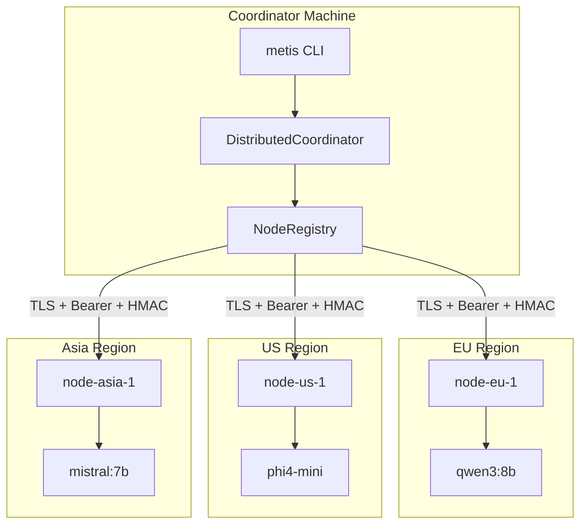
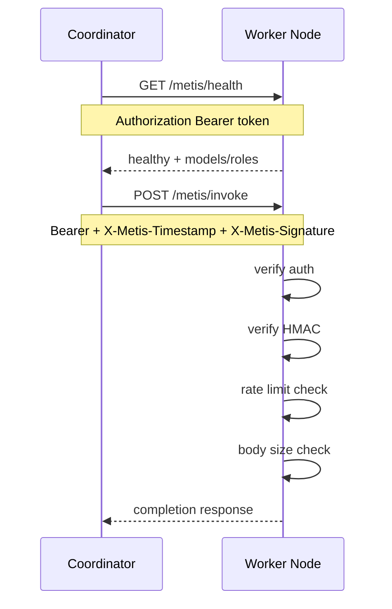

# Distributed Metis

Multi-server architecture: models on different machines, orchestrated as one secured metis.

## Cluster topology



## Security flow



| Layer | Implementation |
|-------|----------------|
| Transport | TLS (`tls_verify: true`) |
| Authentication | Bearer token via `METIS_NODE_*_KEY` env |
| Request signing | HMAC-SHA256 with `METIS_HMAC_SECRET` |
| Rate limiting | Per-IP and per-API-key token bucket |
| Body limits | 512 KB max request body |
| CORS | Locked to configured origins |
| mTLS | Optional via `mtls_cert_path` in security config |
| Audit | Structured JSON logs, no prompt content |

## Production setup

```bash
pip install -e ".[distributed]"

# Node 1 (EU)
export METIS_NODE_EU1_KEY=$(openssl rand -hex 32)
metis-node serve --config node_config.yaml --production --port 8443

# Node 2 (US)
export METIS_NODE_US1_KEY=$(openssl rand -hex 32)
metis-node serve --config node_config.yaml --production --port 8444

# Cluster health
metis-cluster status -c cluster_config.yaml

# Distributed query
metis "Build a distributed system" --cluster cluster_config.yaml
```

### cluster_config.yaml

```yaml
coordinator:
  url: https://coord.example.com

nodes:
  - id: node-eu-1
    url: https://eu1.example.com:8443
    api_key_env: METIS_NODE_EU1_KEY
    models: [qwen3:8b]
    roles: [intent_parser, proposer]

  - id: node-us-1
    url: https://us1.example.com:8443
    api_key_env: METIS_NODE_US1_KEY
    models: [phi4-mini, mistral:7b]
    roles: [red_team, refiner, synthesizer]

security:
  tls_verify: true
  request_signing: true
  hmac_secret_env: METIS_HMAC_SECRET

mcp_ecosystem_presets:
  - aimarket-oracle-gateway
```

## Endpoints

| Endpoint | Method | Auth | Description |
|----------|--------|------|-------------|
| `/metis/health` | GET | Bearer | Liveness + model/role list |
| `/metis/invoke` | POST | Bearer + HMAC | RPC completion |
| `/v1/chat/completions` | POST | Bearer + HMAC | OpenAI-compatible proxy |

## Failover

1. `NodeRegistry.check_health()` probes `/metis/health`
2. `RemoteLLMProvider` tries primary, then failover candidates
3. Unhealthy nodes excluded until next health check passes

## Module map

| File | Responsibility |
|------|----------------|
| `node.py` | NodeDescriptor, health state |
| `registry.py` | Discovery, health checks, failover |
| `remote_provider.py` | LLMProvider over HTTP RPC |
| `coordinator.py` | Parallel dispatch across nodes |
| `security.py` | Auth, HMAC, audit logging |
| `server.py` | Production-hardened FastAPI node |
| `cli.py` | `metis-node`, `metis-cluster` |

## Heterogeneity and research

Placing different models on different nodes aligns with diversity-over-scale findings on reasoning benchmarks (Yang et al., 2026 — [arXiv:2602.03794](https://arxiv.org/abs/2602.03794)). This is **likely** helpful for vote-style council interpretation, not proven for our layered MoA synthesis path. Self-MoA (Li et al., 2025) shows a single strong model can outperform heterogeneous mixes when synthesis quality dominates.

Full digest: [RESEARCH.md](RESEARCH.md).
