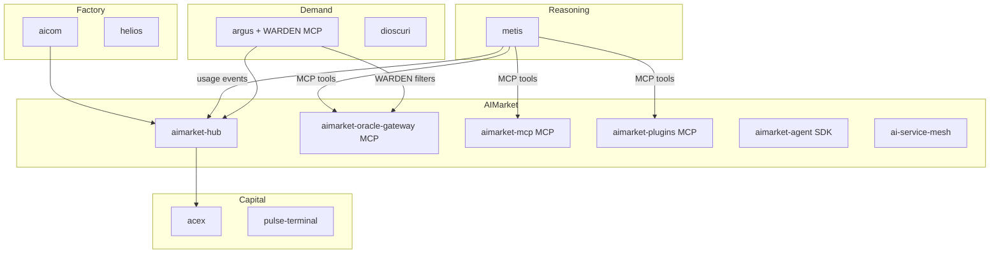
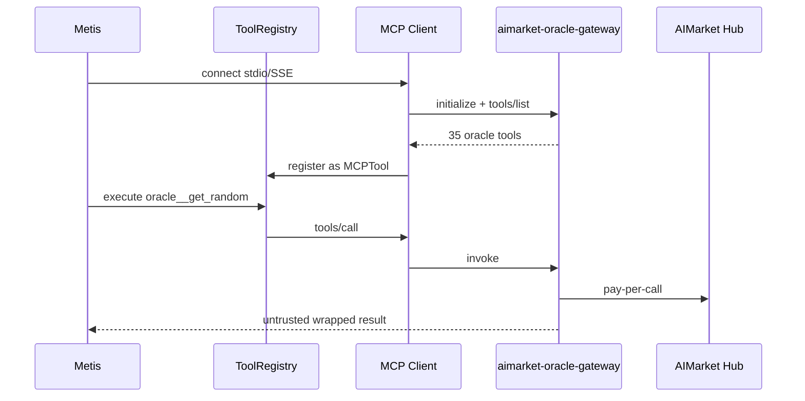
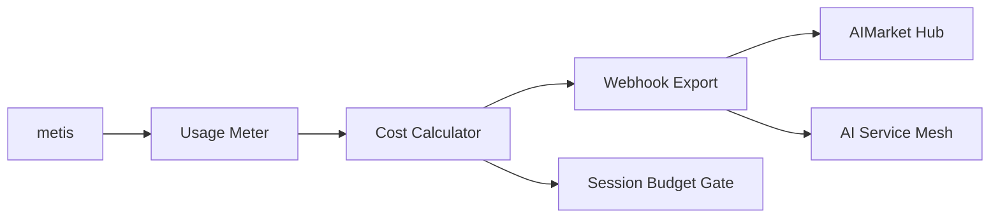
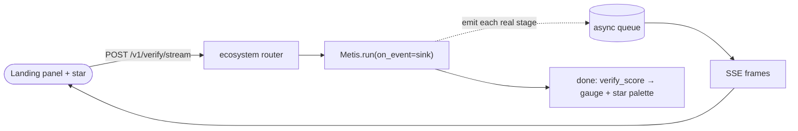
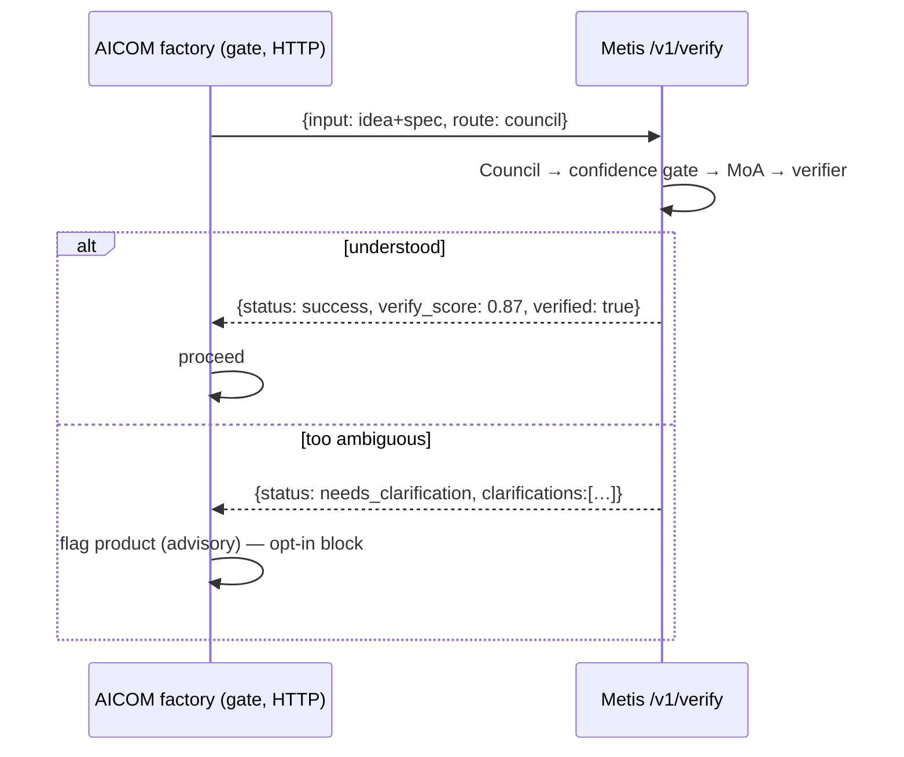

# Metis in the alexar76 Ecosystem

**Metis** is the **reasoning and orchestration layer** above raw LLM endpoints and below demand-side agents like ARGUS.

## Ecosystem integration map



## MCP tool integration



| Server | Tools | Config |
|--------|-------|--------|
| **aimarket-oracle-gateway** | 35 verifiable oracle tools | `mcp_ecosystem_presets: [aimarket-oracle-gateway]` |
| **aimarket-plugins** | 15 hub plugins | `mcp_ecosystem_presets: [aimarket-plugins]` |
| **aimarket-web** ([aimarket-mcp](https://github.com/alexar76/aimarket-mcp)) | web fetch/search + Metis verify (SSRF-hardened gateway) | `mcp_ecosystem_presets: [aimarket-web]` · [Glama](https://glama.ai/mcp/servers/alexar76/aimarket-mcp) |

## Economy integration

The alexar76 ecosystem uses **pay-per-call** metering (AIMarket Hub, oracle gateway). Metis's economy layer aligns with this:



| Ecosystem component | Metis integration |
|--------------------|------------------------|
| **aimarket-oracle-gateway** | MCP tools in agent loop; per-call costs via Hub |
| **aimarket-hub** | Usage webhook export; `aimarket_hub_url` in economy config |
| **ai-service-mesh** | Agent discovery and escrow (complementary) |
| **argus** | Demand-side client; metis as reasoning backend |
| **acex** | Capital market pricing informed by usage reports |

### Economy config

```yaml
economy:
  enabled: true
  currency: USD
  session_budget_usd: 5.0
  aimarket_hub_url: https://modelmarket.dev
  webhook_url: https://your-billing-endpoint/usage
  models:
    gpt-4o: {input_per_1m: 2.50, output_per_1m: 10.00}
```

## When to use what

| Scenario | Use |
|----------|-----|
| Ambiguous task needing TaskSpec | **metis** council route |
| Simple factual Q&A | metis `--route fast` or direct API |
| Production agent with payments | **ARGUS** + aimarket-agent |
| Verifiable randomness/oracles | metis agent + **oracle-gateway MCP** |
| Product manufacturing | **aicom** factory pipeline |

## Architecture wins (honest)

> [!IMPORTANT]
> **Metis is competitive as a verifier + a lift for a mid-tier engine — not as a "garbage
> amplifier."** Live benchmarks (see [`docs/benchmarks/`](../benchmarks/HEAD-TO-HEAD-2026-07-11.md)):
> it lifts a mid model to frontier-adjacent quality (DeepSeek-V4-Pro 96% → 100%) and emits a
> confidence signal a raw call can't; but it adds **no** accuracy to an already-strong model
> on checkable tasks (only latency), and a **weak** aggregator can drag the council *below*
> the best single weak model. Metis auto-enforces the fix via a **capability gate** — the
> strongest configured model takes the aggregator/verifier seat and below-floor models lose
> their council vote (`metis/agents/capability.py`; scores from `metis calibrate`).

| Change | Reliability |
|--------|-------------|
| Confidence gate | **Likely** — early stop, not correctness guarantee |
| Verifier + retry | **Likely** — judge is still an LLM |
| Heterogeneous MoA (≥2 models) | **Likely** with real model diversity; not guaranteed vs one strong model (Li et al., 2025) |
| MCP tool transport | **Guaranteed** for tool access |
| Injection sanitization | **Likely** — reduces attack surface |
| Session budget gate | **Guaranteed** for spend caps |

## Provider surface — the verification envelope

Metis exposes its cognition as an ecosystem *provider* through one small, optional router
(`metis/api/ecosystem.py`). Mounting it changes nothing else, and Metis serves normally without any
ecosystem present.

| Route | Caller | Body → Response |
|-------|--------|-----------------|
| `POST /v1/verify` | any consumer (e.g. the AICOM factory gate) | `{input, route?, min_verify_score?}` → envelope |
| `POST /v1/verify/stream` | landing cognition panel | `{input, route?}` → **SSE** live trace + `done` envelope |
| `POST /aimarket/invoke` | AIMarket Hub | `{input, product_id, capability_id}` → `{result: envelope}` |
| `POST /v1/chat/completions` | alien-monitor chat | OpenAI-compatible chat |
| `GET /health` | consumers' auto-detect | liveness + cluster + knowledge count |

The **envelope** turns "trust one answer" into a machine-readable judgement:

```json
{
  "answer": "…", "status": "success|needs_clarification|error",
  "verified": true, "verify_score": 0.87, "route": "council",
  "depth": "L3_full", "clarifications": [], "usage": {}, "trace_id": "…"
}
```

Register Metis as a paid, discoverable hub capability with the template
`config/aimarket-capability.example.json` (set `invoke_url` → your public `…/aimarket/invoke`, then
`aimarket publish`). Optional.

## Live cognition trace (SSE) — watch it think

`POST /v1/verify/stream` runs the **same** cognition as `/v1/verify`, but streams the pipeline's
**real** events as Server-Sent Events *while they happen*, then a terminal `done` frame with the full
envelope. This is what the landing **cognition panel** and the reactive star consume — so what you
watch is genuine deliberation, not an animation.

```
event: start             data: {route_hint}
event: route_selected    data: {route}                 # router
event: depth_level       data: {depth}                 # DGPD depth gate
event: council_started   data: {agents:[…6]}           # understanding council
event: task_spec_created data: {confidence}            # synthesizer
event: confidence_gate   data: {action,composite_score}
event: moa_layer1/2/3    data: {attempt,skip_refiner}  # mixture-of-agents
event: self_consistency  data: {samples}
event: verify_started | verify_pass | verify_fail  data: {score,attempt}
event: escalation | tool_call | injection_blocked | budget_exceeded
event: done              data: <envelope: verify_score + usage + answer>
```

Events ride an ambient `ContextVar` **event sink** installed only for the request that passes
`on_event=` into `Metis.run` — so it reaches that run's `asyncio.gather` children, never leaks across
concurrent requests, and is a pure no-op (plain logging) otherwise. The endpoint is served without
buffering (`X-Accel-Buffering: no`; nginx `proxy_buffering off`) so multi-second council runs arrive
live rather than as one lump.



The star **reacts** to the stream: a consistent **cyan ignition** when a query starts, per-stage hue
shifts (violet council, indigo MoA), a **convergence** pre-signal a beat before the answer, and a
distinct **completion palette keyed to the verifier confidence** — green-gold "solved" (high), teal
(medium), amber (low), magenta (needs clarification), neutral cyan (fast/unverified). The default
route stays snappy; a **"Deep think"** toggle runs the full council for the richest trace.

The panel also shows a **per-stage time breakdown** (a stacked bar + legend: router / council / MoA /
verify durations, computed from consecutive event timestamps) and a **live connection indicator** —
the chat header probes `GET /health` and shows *live · host* (green) when a real Metis answers, or
*demo* otherwise, so it never claims to be connected when it isn't.

## Use-case: the AICOM factory confidence-gate

### The pain it closes

The AICOM factory builds products **autonomously**: an idea flows through a chain of LLM stages
(`architect` → `methodologist` → `developer` → …) with **no human in the loop between them**. That
creates one specific, expensive failure mode:

> An LLM returns the same fluent, confident answer whether it *understood* the task or *guessed* at
> it. A single confidently-wrong upstream decision — a misread spec, an ambiguous goal silently
> resolved the wrong way — is not caught at the stage that made it. It **compounds through every
> downstream stage** and only surfaces as a product that was built wrong.

The cost of that miss is not one bad call — it's the **entire downstream pipeline** (minutes to hours
of agent time and tokens) *plus* a broken deliverable a human has to notice, diagnose, and unwind
later. A bare model call gives the factory no way to tell "understood" from "guessed", so it can't
stop before paying that cost.

### The gate

For its few high-leverage stages, the factory routes the stage input through `POST /v1/verify`
**before** committing to it. Metis reads the intent with its council, scores whether it's actually
understood (confidence gate), deliberates (MoA), and independently checks the result (verifier) —
returning a **machine-readable judgement** the factory can threshold on, not just another answer.



### Why it's the ideal fit — even given the extra seconds

The gate adds ~20–60 s to a gated stage (council route). That cost is worth paying, by design:

1. **Cost asymmetry.** The gate costs seconds **once, up front**. A confidently-wrong decision costs
   the whole downstream build plus rework. Catching it at the gate is orders of magnitude cheaper than
   catching it after the product ships broken — the seconds are a rounding error against what a bad
   autonomous decision actually costs.
2. **It buys a signal that otherwise doesn't exist.** As our head-to-head shows, on easy inputs a bare
   model is already right — but it *never emits a confidence number*. Metis converts "trust one fluent
   answer" into a `verify_score` + `verified` flag + `clarifications` the factory can act on. You are
   paying seconds for the one thing a bare call cannot give you.
3. **Targeted, not blanket.** Only the few stages where being confidently-wrong is catastrophic are
   gated — not every call. The added latency lands exactly where a mistake is most expensive, and
   nowhere else.
4. **Zero-risk to adopt.** The gate is **opt-in** and **fail-open**: if Metis is slow, down, or absent
   the factory falls back to running exactly as before (silent no-op). So the worst case of the extra
   seconds is bounded — you never trade reliability of the factory itself for it.

**Independence invariant.** The factory talks to Metis over **HTTP only** and **auto-detects** it; the
factory runs with no Metis, and Metis has no knowledge of (or dependency on) the factory. See
[`docs/metis-integration.md`](https://github.com/alexar76/aicom/blob/main/docs/metis-integration.md)
for the factory-side view.

## Alien-monitor

Metis appears as a `cognition` node in the ecosystem monitor; its detail panel shows live
parameters (knowledge entries, cluster nodes, open circuit breakers) and a **chat box** proxied
server-side to `/v1/chat/completions` — a live probe into the reasoning tier.

## Links

- [Research digest](RESEARCH.md) — verified diversity vs scaling citations
- [Ecosystem knowledge base](https://github.com/alexar76/aicom/blob/main/docs/ecosystem/knowledge-base.md)
- [aimarket-protocol](https://github.com/alexar76/aimarket-protocol)
- [aimarket-oracle-gateway](https://github.com/alexar76/aimarket-oracle-gateway)
