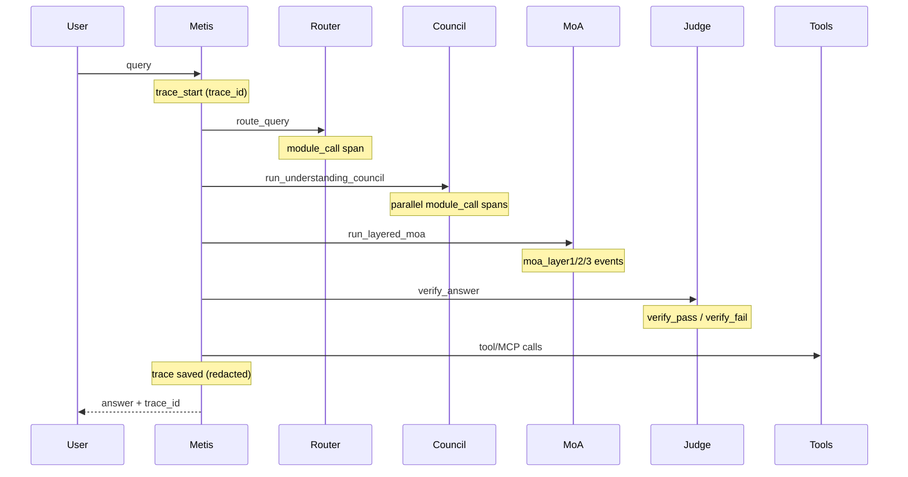

# Observability

**Version 0.1.0** — structured logging, distributed tracing, failure detection, retries, and audit trail.

---

## Overview

Metis observability (`metis/observability/`) provides production-grade visibility into every request without leaking secrets:

| Component | Path | Purpose |
|-----------|------|---------|
| Structured logging | `logging/tracer.py` | JSON logs with `trace_id` + `span_id` |
| Module wrapper | `logging/module_logger.py` | Logs every LLM call (council, MoA, judge, router, tools) |
| Audit trail | `logging/audit.py` | Security events — no PII, no prompts |
| Pipeline events | `logging/pipeline_events.py` | High-level lifecycle events |
| Failure detection | `reliability/detector.py` | Classify errors + retryable flag |
| Retries | `reliability/retry.py` | Exponential backoff + jitter |
| Circuit breaker | `reliability/circuit_breaker.py` | Skip unhealthy endpoints |
| Trace store | `trace_store.py` | Persist traces for `metis logs trace` |

---

## Request trace flow



---

## Structured log fields

Each module LLM call emits JSON with:

| Field | Description |
|-------|-------------|
| `timestamp` | UTC ISO-8601 |
| `trace_id` | Per-request UUID |
| `span_id` | Per LLM call UUID |
| `module_role` | e.g. `judge`, `moa_proposer_logician` |
| `provider` | Provider kind |
| `model` | Model name |
| `endpoint` | Host only — never API keys |
| `latency_ms` | Round-trip time |
| `tokens_in` / `tokens_out` | Token counts |
| `status` | `ok`, `error`, `retry` |
| `error_code` | `timeout`, `rate_limit`, etc. |

---

## Content redaction (security)

**API keys are never logged.** Prompt/response content is controlled by `METIS_LOG_CONTENT`:

| Mode | Behavior |
|------|----------|
| `redacted` (default) | Length + `sha256_prefix` only |
| `hash` | Full SHA-256 digest |
| `full` | Raw content (dev only — warns in production) |

```bash
export METIS_LOG_CONTENT=redacted   # production default
export METIS_LOG_LEVEL=INFO
export METIS_LOG_FORMAT=json
```

---

## Retry policy

Configure in YAML (`config/observability.example.yaml`):

```yaml
reliability:
  max_retries: 3
  base_delay_ms: 500
  max_delay_ms: 30000
  retryable_errors: [timeout, rate_limit, network, model_error]
  circuit_breaker:
    enabled: true
    failure_threshold: 5
    recovery_seconds: 60
```

Read-only LLM calls are retried automatically (idempotent). Auth and parse errors are not retried.

---

## CLI

```bash
metis logs tail              # follow structured logs
metis logs tail -f           # follow log file (METIS_LOG_FILE)
metis logs trace <uuid>      # full trace for one request (redacted)
metis logs stats             # failure rates per module/endpoint
metis logs stats --json
```

---

## Docker

Logs go to **stdout** as JSON for `docker logs` collection. Optional volume `metis-logs` mounts the audit trail:

```yaml
environment:
  METIS_LOG_LEVEL: INFO
  METIS_LOG_FORMAT: json
  METIS_LOG_CONTENT: redacted
  METIS_AUDIT_LOG_FILE: /data/logs/audit.jsonl
volumes:
  - metis-logs:/data/logs
```

---

## Economy integration

`trace_id` is linked to usage metering records (`UsageMeter.trace_id` → `UsageReport.trace_id`) so cost reports can be correlated with traces.

---

## Audit log

Security events (auth failures, injection detected, budget exceeded) go to a separate audit stream with an optional tamper-evident hash chain:

```bash
export METIS_AUDIT_HASH_CHAIN=true
export METIS_AUDIT_LOG_FILE=data/logs/audit.jsonl
```

Audit entries never contain prompts, answers, or API keys.

---

## Related docs

- [SECURITY.md](SECURITY.md) — injection scanning, rate limits
- [DEPLOYMENT.md](DEPLOYMENT.md) — Docker topology
- [ARCHITECTURE.md](ARCHITECTURE.md) — pipeline overview
