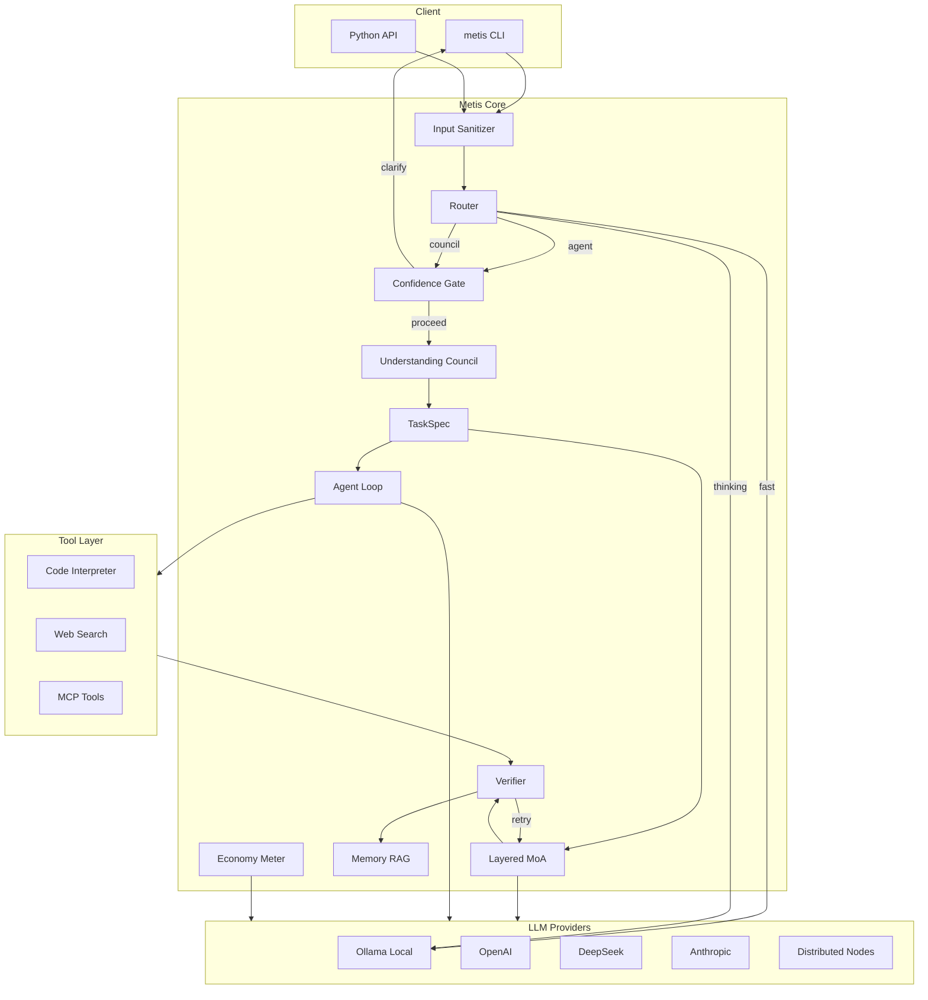
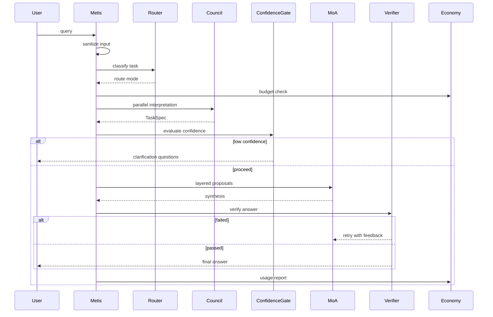
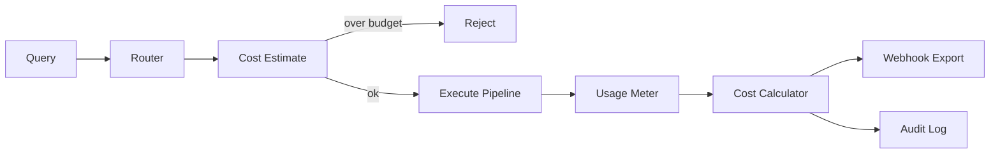
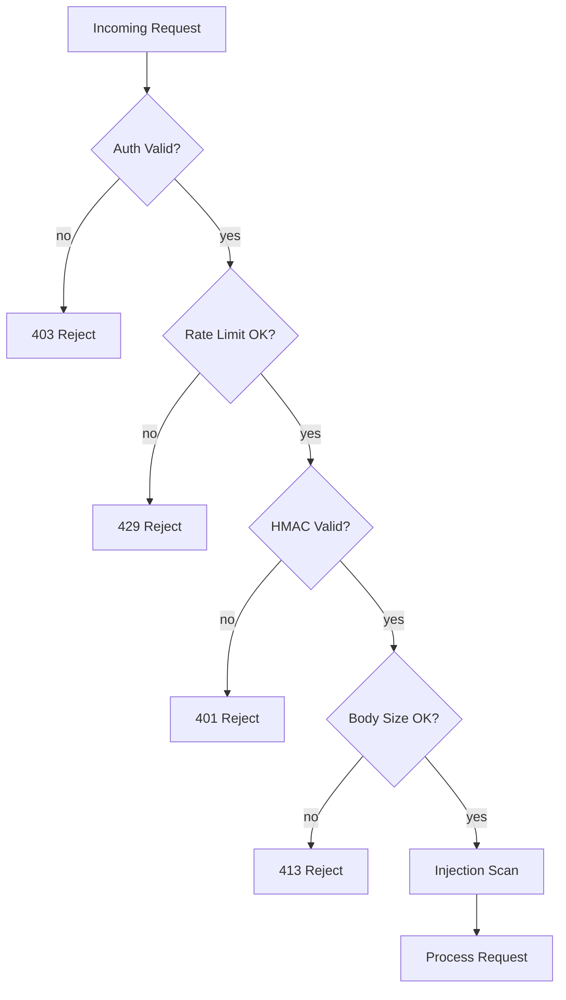
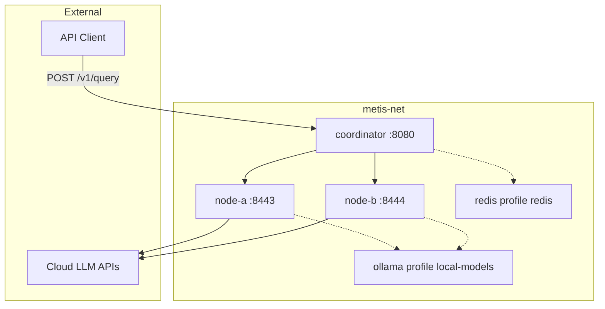

# Metis — User Guide

**Metis** (μῆτις) — counsel, wisdom, deep thought. A distributed cognitive layer over any LLM.

Multi-agent reasoning orchestrator — councils, MoA, tools, MCP, verification, and production security. See [NAMING.md](NAMING.md) for etymology and API conventions.

## Quick start

```bash
cd metis
python3 -m venv .venv && source .venv/bin/activate

# PyPI
pip install "aimarket-metis[dev,distributed]"

# or editable from clone
pip install -e ".[dev,distributed]"

# Ollama (local, free)
ollama pull qwen3:8b
metis "Explain multi-agent systems" --model qwen3:8b --url http://localhost:11434/v1

# OpenAI (set key first)
export METIS_API_KEY=sk-...
metis "Your question" -c config.production.yaml --production
```

Full docs below: [Architecture](ARCHITECTURE.md) · [API](API.md) · [Research evidence](#research-evidence) · [Security](#security) · [Distributed](#distributed-cluster) · [Economy](#economy) · [Ecosystem](ECOSYSTEM.md) · [Research digest](RESEARCH.md)

**Metis is API-only** — no bundled chat UI. Serve with `metis-serve` and integrate via VS Code Continue, Cursor, or `curl` (`POST /v1/chat/completions`).

Per-module model config (`modules:` in YAML) — see [ARCHITECTURE.md](ARCHITECTURE.md#per-module-model-configuration):

```bash
metis config validate -c config.yaml
metis config show-modules -c config.yaml
metis-serve -c config.yaml --port 8080
```

---

## What is metis?

A single LLM makes one interpretation of your task. **Metis** wraps any model with a multi-agent cognitive stack:

- **Understanding Council** — parallel diverse agents → structured `TaskSpec`
- **Confidence gate** — fail-closed before expensive solve paths
- **Layered Mixture-of-Agents (MoA)** — propose → refine → aggregate
- **Agent loop** — plan, act, observe, reflect with tools + MCP
- **Verifier** — judge checks answer against task contract
- **Economy layer** — usage metering, cost attribution, budget gates
- **Production security** — prompt injection defense, SSRF, rate limits

## Architecture



## Data flow



| Layer | Responsibility |
|-------|----------------|
| **Input Sanitizer** | Injection detection, canary tokens, role enforcement |
| **Router** | Classifies complexity → route mode |
| **Confidence Gate** | Fail-closed before solve (composite score) |
| **Understanding Council** | Parallel agents → `TaskSpec` |
| **Layered MoA** | Multiple perspectives collaborate |
| **Agent Loop** | Plan-Act-Observe-Reflect with tools |
| **Verifier** | Judge validates answer vs TaskSpec |
| **Economy** | Token metering, cost, budget gates |
| **Memory** | Working + episodic + vector store |

## Research evidence

Honest mapping from our architecture docs to what published work actually shows. Full digest: [RESEARCH.md](RESEARCH.md).

| Our claim | What research actually says | Caveats | Citation |
|-----------|----------------------------|---------|----------|
| **≥2 heterogeneous models** beat scaling many copies of one model | On 7 reasoning benchmarks with 7–8B open models, 2 fully diverse agents (L4) match or exceed 16 homogeneous agents (L1) under vote/debate | Vote/debate protocols; not layered MoA; not GPT-4 scale | [Yang et al., 2026](https://arxiv.org/abs/2602.03794) |
| **Layered MoA** improves answer quality | Open-source layered MoA reaches 65.1% LC win rate on AlpacaEval 2.0 vs 57.5% for GPT-4 Omni | Instruction-following benchmarks; higher cost than single call | [Wang et al., ICLR 2025](https://arxiv.org/abs/2406.04692) |
| **Homogeneous scaling** has diminishing returns | Accuracy gains per added identical agent collapse; correlated outputs saturate effective channels (K\*) | Empirical on listed benchmarks; agentic tool loops not studied | [Yang et al., 2026](https://arxiv.org/abs/2602.03794) |
| **Diversity > raw agent count** for reasoning | Heterogeneous configs consistently beat homogeneous scaling at same or lower agent count on reasoning-heavy tasks | Weaker on factual-retrieval tasks; persona-only diversity has mixed gains | [Yang et al., 2026](https://arxiv.org/abs/2602.03794) |
| **Heterogeneous MoA** is always best | **Often false** for synthesis: Self-MoA (one strong model) beats mixed MoA on AlpacaEval 2.0 (+6.6 pp) and averages +3.8% on MMLU/CRUX/MATH | Mixing weaker models lowers quality; complementary specialists can still help | [Li et al., 2025](https://arxiv.org/abs/2502.00674) |
| **Verifier / judge** matters as much as diversity | Diverse team + judge: 0.810 WR; MoA-style synthesis lost to baseline in 0/42 judge-rated tasks | Single-round pipelines; judge must be capable | [arXiv:2603.20324](https://arxiv.org/abs/2603.20324) |
| **Naive multi-agent debate** on small models fails | SLM debate can drop below single-agent (~10% reported) via sycophantic drift; MMAD mitigates with structured mutual awareness | 3–8B models; multi-round **debate** — our council is parallel, not debate | [MMAD, OpenReview](https://openreview.net/forum?id=0h3dbL6Iy3) |
| **Temperature spread** on one model = diversity | Treated as **weak** diversity in our config; not equivalent to multi-model heterogeneity in scaling studies | Persona/temperature helps less than model mixing on reported benchmarks | [Yang et al., 2026](https://arxiv.org/abs/2602.03794); [Li et al., 2025](https://arxiv.org/abs/2502.00674) |

**Confidence legend:** *proven* = direct benchmark result in cited paper; *likely* = supported but task-/model-specific; *plausible* = architectural analogy, not A/B tested in this repo.

## Optimal network size

How many council/MoA agents to run — research-informed defaults, not guarantees.

| Setting | Default | Rationale |
|---------|---------|-----------|
| Minimum unique models | **2** | Yang et al. (2026): full diversity at N=2 can match homogeneous N=16 on vote/debate benchmarks[^scaling] |
| Council roles | **5 slots** (3 parsers + constraint + ambiguity + red team → synthesizer) | Role diversity is a **weak** supplement; not independently validated at this count |
| MoA proposers | **3** parallel roles | Follows MoA layered design[^moa]; count is engineering default, not optimal from ablations |
| Homogeneous replicas | **Avoid** beyond 2–4 | Diminishing returns when outputs correlate[^scaling] |
| Small models (≤8B) + debate | **Avoid** naive multi-round debate | Sycophantic drift on SLMs[^mmad]; use parallel council + verifier instead |

[^scaling]: Yang et al., *Understanding Agent Scaling in LLM-Based Multi-Agent Systems via Diversity*, arXiv:2602.03794, 2026. Tested on 7B–8B open models, seven benchmarks, vote and debate — not production agent loops.
[^moa]: Wang et al., *Mixture-of-Agents Enhances Large Language Model Capabilities*, ICLR 2025 Spotlight, arXiv:2406.04692. Gains shown on AlpacaEval 2.0, MT-Bench, Arena-Hard, FLASK.
[^mmad]: *MMAD: Multi-Agent Mutual Awareness Debate*, OpenReview submission (venue TBD). Naive debate on 3–8B SLMs; metis council is parallel-isolated by design.

For heterogeneous cluster layout, see [DISTRIBUTED.md](DISTRIBUTED.md#heterogeneity-and-research).

## Economy



```yaml
economy:
  enabled: true
  currency: USD
  session_budget_usd: 5.0
  models:
    gpt-4o: {input_per_1m: 2.50, output_per_1m: 10.00}
    deepseek-chat: {input_per_1m: 0.14, output_per_1m: 0.28}
    qwen3:8b: {input_per_1m: 0, output_per_1m: 0}
```

**Cost optimization tips:**
- Use `--route fast` for simple factual queries (1 LLM call)
- Reserve `council` for ambiguous or high-stakes tasks (12+ calls)
- Run local Ollama models for zero API cost
- Set `session_budget_usd` to cap spend per session
- Enable economy webhook to integrate with AIMarket billing

## Security

### Threat model

| Threat | Mitigation |
|--------|------------|
| Prompt injection | Input sanitization, canary tokens, `<untrusted>` wrapping |
| Tool output injection | All tool/MCP output wrapped as untrusted data |
| SSRF (web search) | URL validation, redirect hop checks, private IP block |
| Code execution escape | Subprocess sandbox, blocked imports, timeout |
| Unauthorized node access | Bearer auth required in production, fail-closed |
| Replay attacks | HMAC signing with 5-min timestamp window |
| Rate abuse | Per-IP and per-API-key token bucket |
| Data exfiltration | Audit logs exclude prompts and secrets |



### Production deployment

```bash
export METIS_API_KEY=your-key
export METIS_NODE_EU1_KEY=node-secret-1
export METIS_HMAC_SECRET=hmac-secret

metis-node serve -c node_config.yaml --production --port 8443
metis "query" -c config.production.yaml --production
```

See [DISTRIBUTED.md](DISTRIBUTED.md) for cluster setup and [ECOSYSTEM.md](ECOSYSTEM.md) for alexar76 integration.

## Docker Deployment

Run the full distributed stack (coordinator + 2 worker nodes) in containers.

### Quick start

```bash
cp config/docker.env.example .env   # edit secrets
docker compose up -d --build
curl http://localhost:8080/health
```

### Topology



### Services

| Service | Role | Port |
|---------|------|------|
| `coordinator` | HTTP API (`POST /v1/query`, `GET /health`) | 8080 |
| `node-a` | Worker node (parser, proposer) | 8443 |
| `node-b` | Worker node (red team, refiner) | 8444 |
| `ollama` | Local LLM backend (profile `local-models`) | 11434 |
| `redis` | Rate limiting / sessions (profile `redis`) | 6379 |

### Profiles

```bash
# Default: coordinator + nodes → external APIs via .env
docker compose up -d

# Include local Ollama (set OLLAMA_BASE_URL=http://ollama:11434/v1 in .env)
docker compose --profile local-models up -d

# Production hardening (resource limits, logging, restart policies)
docker compose -f docker-compose.yml -f docker-compose.prod.yml up -d
```

### Scaling nodes

```bash
docker compose up -d --scale node-a=2
```

Scaled replicas share the internal DNS name `node-a`; the coordinator load-balances via `NodeRegistry` failover.

### Production checklist

- [ ] Copy `config/docker.env.example` → `.env` with strong random keys
- [ ] Set `METIS_API_KEY` (or legacy `COGNITIVE_API_KEY`)
- [ ] Set `METIS_NODE_A_KEY` and `METIS_NODE_B_KEY`
- [ ] Never enable `allow_test_provider` or mock provider in production
- [ ] Use `docker-compose.prod.yml` for resource limits and log rotation
- [ ] Terminate TLS at nginx/traefik (see comments in `docker-compose.prod.yml`)
- [ ] Containers run read-only root, `cap_drop: ALL`, `no-new-privileges`

## Provider configuration

| Provider | Config | Base URL |
|----------|--------|----------|
| Ollama (local) | `provider: ollama` | `http://localhost:11434/v1` |
| OpenAI | `provider: openai_compat` | `https://api.openai.com/v1` |
| DeepSeek | `provider: openai_compat` | `https://api.deepseek.com/v1` |
| Anthropic | `provider: anthropic` | `https://api.anthropic.com` |

## Distributed cluster

See [DISTRIBUTED.md](DISTRIBUTED.md).

## MCP integration

```yaml
enable_mcp_tools: true
mcp_ecosystem_presets:
  - aimarket-oracle-gateway   # 35 verifiable oracle tools
  - aimarket-web              # aimarket-mcp: web_fetch, web_search, metis_verify
```

See [`aimarket-mcp`](https://github.com/alexar76/aimarket-mcp) (stdio on [Glama](https://glama.ai/mcp/servers/alexar76/aimarket-mcp)) and [ECOSYSTEM.md](ECOSYSTEM.md).

## Python API

```python
import asyncio
from metis import Metis, RuntimeConfig
from metis.config import ProviderKind

config = RuntimeConfig(
    provider=ProviderKind.OLLAMA,
    base_model="qwen3:8b",
    base_url="http://localhost:11434/v1",
)
result = asyncio.run(Metis(config).run("Your task"))
print(result.answer)
```

## Tests

```bash
pytest -v
```

## Bibliography

1. Yang, Y., Qu, C., Wen, M., Shi, L., Wen, Y., Zhang, W., Wierman, A., & Gu, S. (2026). Understanding Agent Scaling in LLM-Based Multi-Agent Systems via Diversity. *arXiv:2602.03794*. https://arxiv.org/abs/2602.03794
2. Wang, J., Wang, J., Athiwaratkun, B., Zhang, C., & Zou, J. (2025). Mixture-of-Agents Enhances Large Language Model Capabilities. *ICLR 2025 (Spotlight)*. arXiv:2406.04692. https://arxiv.org/abs/2406.04692
3. Li, W., Lin, Y., Xia, M., & Jin, C. (2025). Rethinking Mixture-of-Agents: Is Mixing Different Large Language Models Beneficial? *arXiv:2502.00674*. https://arxiv.org/abs/2502.00674
4. When Agents Disagree: The Selection Bottleneck in Multi-Agent LLM Pipelines. (2026). *arXiv:2603.20324*. https://arxiv.org/abs/2603.20324
5. MMAD: Multi-Agent Mutual Awareness Debate — A Theory-of-Mind Framework for Stabilizing Small Language Model Debate. OpenReview. https://openreview.net/forum?id=0h3dbL6Iy3
6. Pitre, P., Ramakrishnan, N., & Wang, X. (2025). CONSENSAGENT: Towards Efficient and Effective Consensus in Multi-Agent LLM Interactions Through Sycophancy Mitigation. *ACL Findings 2025*. https://doi.org/10.18653/v1/2025.findings-acl.1141
7. Yao, B., Shang, C., Du, W., He, J., Lian, R., Zhang, Y., Su, H., Swamy, S., & Qi, Y. (2025). Peacemaker or Troublemaker: How Sycophancy Shapes Multi-Agent Debate. *arXiv:2509.23055*. https://arxiv.org/abs/2509.23055

## License

MIT
