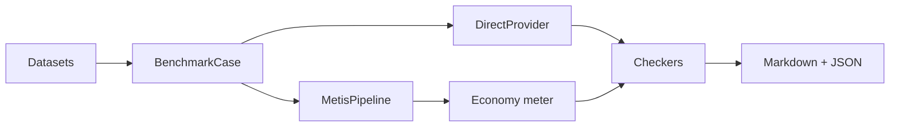

# Benchmarks — Direct API vs Metis

Comparación de **una llamada directa al LLM** frente al **exoesqueleto completo de Metis** (consejo de comprensión, confidence gate, MoA, verificador) con los mismos modelos y prompts.

## Inicio rápido

```bash
cd metis
pip install -e ".[dev]"

# Sin conexión (CI, proveedor mock)
metis-benchmark run --mock --dataset simple --compare direct,metis

# DeepSeek en vivo
export DEEPSEEK_API_KEY=sk-...
metis-benchmark run --models deepseek-chat --dataset all --compare direct,metis \
  --output reports/bench-$(date +%Y%m%d).md

metis-benchmark list-models
metis-benchmark list-datasets
```

## Qué medimos

| Métrica | Descripción |
|---------|-------------|
| **Latencia (ms)** | Tiempo por caso |
| **Tokens in/out** | Del usage de la API o estimación |
| **Coste (USD)** | Vía `CostCalculator` del módulo economy |
| **Nº de llamadas** | Direct = 1; Metis = eventos UsageMeter |
| **Profundidad** | Estimación de ruta (fast=1 … council=12) |
| **Pass rate** | Casos que pasan los checkers |

## Datasets

| Archivo | Categoría | Casos | Objetivo |
|---------|-----------|------:|----------|
| `task_understanding.jsonl` | trap, ambiguous | 12 | Metis debe aclarar |
| `reasoning.jsonl` | reasoning | 12 | Matemáticas/lógica verificables |
| `factual.jsonl` | factual | 10 | Conocimiento estático |
| `simple.jsonl` | simple | 10 | Trivial — Direct más rápido |

## Informe de ejemplo

| Model | Runner | Cases | Pass rate | Avg latency (ms) | Avg cost (USD) | Avg calls |
|-------|--------|------:|----------:|-----------------:|---------------:|----------:|
| deepseek-chat | direct | 44 | 82% | 890 | 0.000120 | 1.0 |
| deepseek-chat | metis | 44 | 91% | 12400 | 0.001450 | 8.2 |

## Flujo del benchmark



## Cuándo Metis debería ganar

- **Prompts ambiguos / trampas** — pedir aclaración en lugar de adivinar.
- **Razonamiento multi-paso** — consejo y verificador detectan errores.
- **Tareas de agente** — `TaskSpec` estructurado.

## Cuándo Direct debería ganar

- **FAQ simples** — una llamada basta.
- **SLO estricto de latencia** — Metis hace varias llamadas LLM.
- **Presupuesto ajustado** — la mejora de calidad puede no compensar 5–12× tokens.

## Variables de entorno

| Variable | Proveedor |
|----------|-----------|
| `DEEPSEEK_API_KEY` | deepseek-chat |
| `OPENAI_API_KEY` | gpt-4o-mini |
| _(ninguna)_ | qwen3:8b vía Ollama |

## CI

- `pytest -m benchmark` — tests mock sin claves.
- `benchmark.yml` — solo dispatch manual con secretos.
