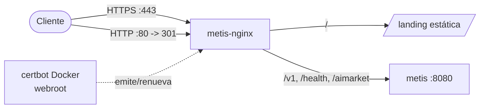

# Guía de despliegue de Metis

**Versión 0.1.0** · Docker, configuración de producción, secretos y escalado

---

## Inicio rápido

```bash
cp .env.example .env
# Configure METIS_API_KEY, claves de proveedores, claves de nodos

docker compose up -d --build

curl -s http://localhost:8080/health
```

Stack por defecto: **coordinator** + **node-a** + **node-b** en la red interna `metis-net`.

---

## Docker Compose

| Servicio | Rol | Puerto |
|----------|-----|--------|
| `coordinator` | API OpenAI + enrutamiento | `8080` |
| `node-a` | Worker LLM | internal `8443` |
| `node-b` | Worker LLM | internal `8444` |
| `ollama` | Inferencia local (perfil `local-models`) | internal |
| `redis` | Caché (perfil `redis`) | internal |

### Endurecimiento de contenedores

- `read_only: true`
- `cap_drop: ALL`
- `security_opt: no-new-privileges:true`
- Usuario no root `metis` (uid 1000)

### Perfiles

```bash
docker compose --profile local-models up -d
docker compose --profile redis up -d
```

---

## Configuración de producción

`config.production.yaml`:

- `production: true`
- `enforce_confidence_gate: true`
- `economy.session_budget_usd: 5.0`
- `security.enforce_injection_scan: true`
- `security.rate_limit`: 60 req/min, burst 10

```bash
export METIS_CONFIG_PATH=config.production.yaml
metis-serve --production --host 0.0.0.0 --port 8080
```

---

## Gestión de secretos

**Nunca commitear secretos en YAML.**

| Secreto | Dónde configurar |
|---------|------------------|
| `METIS_API_KEY` | `.env` |
| `METIS_NODE_A_KEY` / `METIS_NODE_B_KEY` | `.env` |
| `METIS_HMAC_SECRET` | `.env` |
| Claves de proveedores LLM | `.env` vía `api_key_env` |

El entrypoint del coordinator falla si `METIS_PRODUCTION=true` sin `METIS_API_KEY`.

---

## Escalado

### Horizontal — añadir nodos worker

1. Crear `config/docker-node-c.yaml`
2. Añadir servicio `node-c` en `docker-compose.yml`
3. Registrar nodo en `docker-cluster.yaml`
4. `docker compose up -d node-c`

### Control de costes

```yaml
economy:
  enabled: true
  session_budget_usd: 5.0
  require_budget_for_routes: [council, agent]
```

---

## Health checks

| Objetivo | Endpoint | Auth |
|----------|----------|------|
| Coordinator | `GET /health` | No |
| Worker | `GET /metis/health` | Bearer `METIS_NODE_*_KEY` |

---

## Dominio público + HTTPS

Para servir la landing y la API en un dominio propio con TLS, coloca un
contenedor `nginx:alpine` delante de la API y termina HTTPS ahí. La
configuración reproducible y los comandos paso a paso están en
[`deploy/nginx.conf`](../../deploy/nginx.conf) y
[`deploy/README.md`](../../deploy/README.md).



Puntos clave:

- **DNS** — apunta un registro `A` al nodo (p. ej. `metis.modelmarket.dev`).
- **TLS** — los certificados los emite y renueva la **imagen Docker de certbot**
  (método webroot), sin paquetes en el host (funciona en hosts con apt bloqueado).
  Un cron semanal renueva y recarga nginx automáticamente.
- **Redirección** — el dominio siempre pasa de HTTP a HTTPS; la IP desnuda sigue
  sirviendo HTTP plano para pruebas rápidas.
- **Endurecimiento** — solo TLS 1.2/1.3, HSTS y límite de peticiones por IP en la API.
- **Aislamiento** — nginx termina el TLS; el contenedor de la API permanece en la
  red docker interna y nunca se publica en el host.

Referencia en vivo: **https://metis.modelmarket.dev**.

---

## Documentación relacionada

- [API.md](API.md) — endpoints
- [SECURITY.md](SECURITY.md) — endurecimiento
- [DISTRIBUTED.md](DISTRIBUTED.md) — clúster

Versión completa en inglés: [../en/DEPLOYMENT.md](../en/DEPLOYMENT.md)
