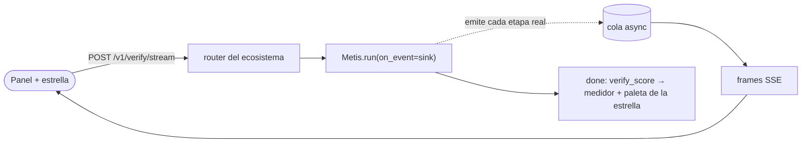
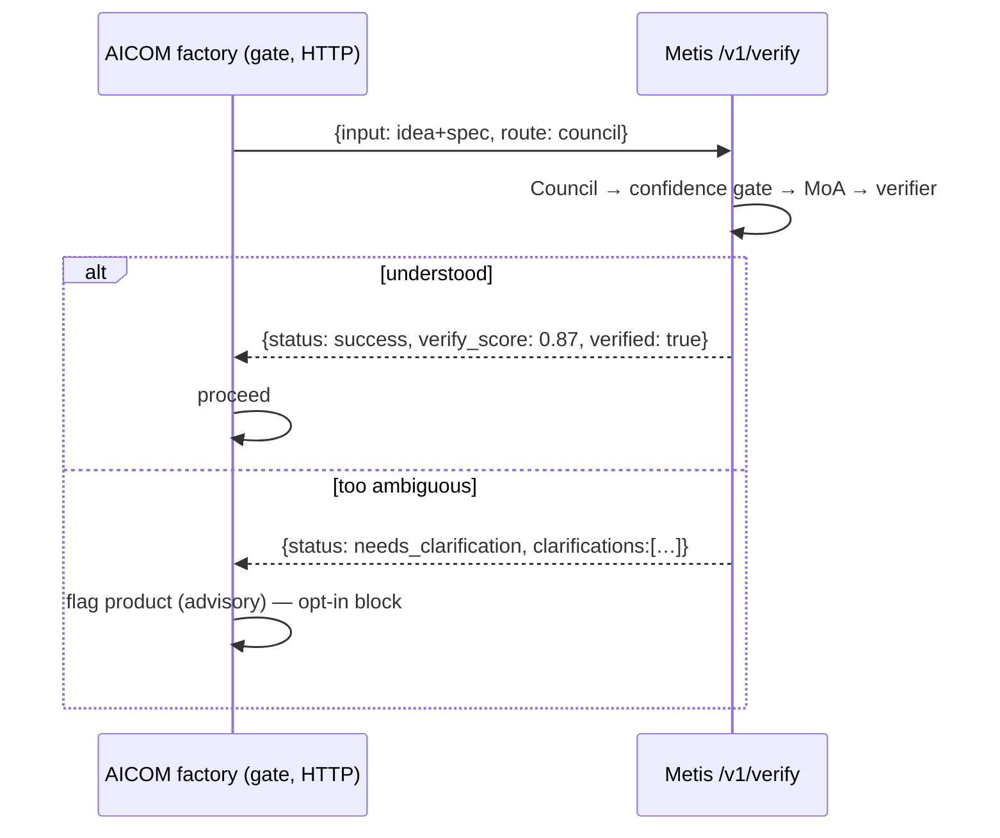

# Metis en el ecosistema alexar76

**Metis** es la capa de **razonamiento y orquestación** — encima de los endpoints LLM y debajo de agentes de demanda como ARGUS. No sustituye AIMarket; consume capacidades del marketplace vía MCP.

## Mapa del ecosistema

| Capa | Repos | Rol |
|------|-------|-----|
| **Fábrica** | `aicom`, `helios`, `aicom-landing` | Producción de productos |
| **AIMarket** | `aimarket-protocol`, `aimarket-hub`, `aimarket-agent` | Catálogo, invoke, pagos |
| **Oráculos** | `oracles`, `aimarket-oracle-gateway` | Matemática verificable |
| **Demanda** | `argus`, `dioscuri` | Clientes de referencia |
| **Capital** | `acex`, `pulse-terminal` | Mercado de agentes |
| **Visualización** | `alien-monitor`, `aimarket-courses` | Grafo 3D, formación |
| **Razonamiento** | **`metis`** | Council, MoA, herramientas, MCP |

## Dónde encaja metis

Orquestador de razonamiento multiagente:

1. **Understanding Council** → `TaskSpec` estructurado
2. **Confidence gate** → fail-closed si la confianza es baja
3. **MoA + verifier** → síntesis y validación
4. **Agent loop** → herramientas integradas + MCP del ecosistema

### Cuándo usar metis

- Tareas ambiguas que requieren contrato antes de resolver
- Respuestas críticas con verificación y reintentos
- Oráculos/hub vía MCP (`aimarket-oracle-gateway`)
- Clúster distribuido con modelos heterogéneos

### Cuándo modelo directo

- Hechos simples → `--route fast`
- Chat con latencia estricta

### Cuándo ARGUS / aimarket-agent

- Agente de producción con pago y firewall WARDEN MCP

## Catálogo MCP

| Servidor | Herramientas | Config |
|----------|--------------|--------|
| **aimarket-oracle-gateway** | 35 oráculos | `mcp_ecosystem_presets: [aimarket-oracle-gateway]` |
| **aimarket-plugins** | 15 plugins | `mcp_ecosystem_presets: [aimarket-plugins]` |
| **aimarket-web** | fetch/búsqueda web + Metis verify (gateway con SSRF) | `mcp_ecosystem_presets: [aimarket-web]` |

```yaml
enable_mcp_tools: true
mcp_ecosystem_presets:
  - aimarket-oracle-gateway
```

## Mejoras (evaluación honesta)

> [!IMPORTANT]
> **Metis es competitivo como verificador y como impulso a un motor de gama media — no como
> "amplificador de basura".** Benchmarks en vivo (ver [`docs/benchmarks/`](../benchmarks/HEAD-TO-HEAD-2026-07-11.md)):
> eleva un motor medio a calidad cercana a la frontera (DeepSeek-V4-Pro 96% → 100%) y emite una
> señal de confianza que una llamada pelada no da; pero **no** añade precisión a un modelo ya
> fuerte en tareas verificables (solo latencia), y un agregador **débil** puede arrastrar al
> consejo *por debajo* del mejor modelo débil individual. Metis lo corrige automáticamente con
> una **puerta de capacidad**: el modelo más fuerte configurado ocupa el asiento de
> agregador/verificador y los modelos bajo el umbral pierden su voto en el consejo
> (`metis/agents/capability.py`; puntuaciones de `metis calibrate`).

| Cambio | Fiabilidad |
|--------|------------|
| Confidence gate | **Probable** — no garantiza corrección |
| Verifier + retry | **Probable** — el juez es un LLM |
| MoA heterogéneo (≥2 modelos) | **Probable** — no garantizado vs un modelo fuerte (Li et al., 2025) |
| MCP como capa de tools | **Garantizado** para acceso a herramientas |

## Superficie del proveedor — el sobre de verificación

Metis expone su cognición como un *provider* del ecosistema a través de un pequeño router opcional
(`metis/api/ecosystem.py`). Montarlo no cambia nada más, y Metis funciona con normalidad sin
necesidad de que exista ecosistema alguno.

| Ruta | Invocador | Cuerpo → Respuesta |
|-------|--------|-----------------|
| `POST /v1/verify` | cualquier consumidor (p. ej. el gate de la factory AICOM) | `{input, route?, min_verify_score?}` → envelope |
| `POST /v1/verify/stream` | panel de cognición de la landing | `{input, route?}` → **SSE** traza en vivo + envelope `done` |
| `POST /aimarket/invoke` | AIMarket Hub | `{input, product_id, capability_id}` → `{result: envelope}` |
| `POST /v1/chat/completions` | chat de alien-monitor | chat compatible con OpenAI |
| `GET /health` | autodetección de los consumidores | disponibilidad + clúster + recuento de conocimiento |

El **envelope** convierte "confía en una respuesta" en un juicio legible por máquina:

```json
{
  "answer": "…", "status": "success|needs_clarification|error",
  "verified": true, "verify_score": 0.87, "route": "council",
  "depth": "L3_full", "clarifications": [], "usage": {}, "trace_id": "…"
}
```

Registra Metis como una capability del hub de pago y descubrible con la plantilla
`config/aimarket-capability.example.json` (establece `invoke_url` → tu `…/aimarket/invoke` público, luego
`aimarket publish`). Opcional.

## Traza de cognición en vivo (SSE) — verla pensar

`POST /v1/verify/stream` ejecuta la **misma** cognición que `/v1/verify`, pero transmite los eventos
**reales** del pipeline como Server-Sent Events *a medida que ocurren*, y luego un frame final `done`
con el envelope completo. Esto es lo que consumen el **panel de cognición** de la landing y la estrella
reactiva — así que lo que ves es deliberación genuina, no una animación.

```
event: start             data: {route_hint}
event: route_selected    data: {route}                 # router
event: depth_level       data: {depth}                 # gate de profundidad DGPD
event: council_started   data: {agents:[…6]}           # consejo de comprensión
event: task_spec_created data: {confidence}            # sintetizador
event: confidence_gate   data: {action,composite_score}
event: moa_layer1/2/3    data: {attempt,skip_refiner}  # mixture-of-agents
event: self_consistency  data: {samples}
event: verify_started | verify_pass | verify_fail  data: {score,attempt}
event: escalation | tool_call | injection_blocked | budget_exceeded
event: done              data: <envelope: verify_score + usage + answer>
```

Los eventos viajan por un **sink** en un `ContextVar` instalado solo para la petición que pasa
`on_event=` a `Metis.run` — por eso llega a los hijos `asyncio.gather` de esa ejecución, nunca se filtra
entre peticiones concurrentes y en el resto de los casos es un no-op puro (solo logging). El endpoint se
sirve sin buffering (`X-Accel-Buffering: no`; nginx `proxy_buffering off`), de modo que las ejecuciones
council de varios segundos llegan en vivo y no en un solo bloque.



La estrella **reacciona** al stream: una **ignición cian** consistente al empezar una consulta,
cambios de tono por etapa (violeta consejo, índigo MoA), una **señal de convergencia** un instante
antes de la respuesta, y una **paleta de finalización según la confianza del verificador** — verde-oro
"resuelto" (alta), turquesa (media), ámbar (baja), magenta (necesita aclaración), cian neutro
(fast/no verificado). La ruta por defecto se mantiene ágil; un interruptor **"Deep think"** ejecuta el
consejo completo para la traza más rica.

El panel también muestra un **desglose de tiempo por etapa** (una barra apilada + leyenda: duraciones
de router / council / MoA / verify, calculadas a partir de las marcas de tiempo de eventos
consecutivos) y un **indicador de conexión en vivo** — la cabecera del chat sondea `GET /health` y
muestra *live · host* (verde) cuando responde un Metis real, o *demo* en caso contrario, de modo que
nunca afirma estar conectado cuando no lo está.

## Caso de uso: el confidence-gate de la factory AICOM

### El dolor que resuelve

La factory AICOM construye productos de forma **autónoma**: una idea fluye por una cadena de etapas LLM
(`architect` → `methodologist` → `developer` → …) **sin humano en el bucle entre ellas**. Eso genera un
modo de fallo específico y caro:

> Un LLM devuelve la misma respuesta fluida y segura tanto si *entendió* la tarea como si la *adivinó*.
> Una única decisión segura-pero-errónea aguas arriba — una spec mal leída, un objetivo ambiguo resuelto
> en silencio hacia el lado equivocado — no se detecta en la etapa que la tomó. Se **propaga por todas
> las etapas siguientes** y solo aflora como un producto construido mal.

El coste de ese fallo no es una llamada mala: es **todo el pipeline aguas abajo** (minutos u horas de
tiempo de agente y tokens) *más* un entregable roto que un humano tiene que notar, diagnosticar y
deshacer después. Una llamada pelada al modelo no le da a la factory forma de distinguir «entendió» de
«adivinó», así que no puede detenerse antes de pagar ese coste.

### El gate

Para sus pocas etapas de alto riesgo, la factory enruta la entrada de la etapa por `POST /v1/verify`
**antes** de comprometerse con ella. Metis lee la intención con su council, puntúa si de verdad se
entendió (confidence gate), delibera (MoA) y verifica el resultado de forma independiente (verifier) —
devolviendo un **juicio legible por máquina** sobre el que la factory puede fijar un umbral, no solo otra
respuesta más.



### Por qué es la solución ideal — incluso con los segundos extra

El gate añade ~20–60 s a la etapa que cubre (ruta council). Ese coste vale la pena, por diseño:

1. **Asimetría de coste.** El gate cuesta segundos **una vez, por adelantado**. Una decisión
   segura-pero-errónea cuesta todo el build aguas abajo más el retrabajo. Atraparla en el gate es órdenes
   de magnitud más barato que atraparla tras enviar el producto roto — los segundos son un error de
   redondeo frente a lo que cuesta de verdad una mala decisión autónoma.
2. **Compra una señal que si no, no existe.** Como muestra nuestra comparativa directa, en entradas
   fáciles el modelo pelado ya acierta — pero *nunca emite un número de confianza*. Metis convierte
   «confía en una respuesta fluida» en un `verify_score` + flag `verified` + `clarifications` sobre los
   que la factory puede actuar. Pagas segundos por lo único que una llamada pelada no puede darte.
3. **Selectivo, no general.** Solo se cubren las pocas etapas donde estar seguro-y-equivocado es
   catastrófico — no cada llamada. La latencia extra cae justo donde un error es más caro, y en ningún
   otro sitio.
4. **Riesgo cero al adoptar.** El gate es **opt-in** y **fail-open**: si Metis está lento, caído o
   ausente, la factory vuelve a funcionar exactamente como antes (no-op silencioso). Así el peor caso de
   los segundos extra está acotado — nunca cambias por ellos la fiabilidad de la propia factory.

**Invariante de independencia.** La factory se comunica con Metis **solo por HTTP** y lo **autodetecta**;
la factory funciona sin Metis, y Metis no tiene conocimiento (ni dependencia) de la factory. Consulta
[`docs/metis-integration.md`](https://github.com/alexar76/aicom/blob/main/docs/metis-integration.md)
para la vista del lado de la factory.

## Alien-monitor

Metis aparece como un nodo `cognition` en el monitor del ecosistema; su panel de detalle muestra
parámetros en vivo (entradas de conocimiento, nodos del clúster, circuit breakers abiertos) y un **chat box**
proxyeado en el servidor hacia `/v1/chat/completions` — una sonda en vivo hacia la capa de razonamiento.

## Enlaces

- [Evidencia científica](RESEARCH.md)
- [Base de conocimiento](https://github.com/alexar76/aicom/blob/main/docs/ecosystem/knowledge-base-es.md)
- [aimarket-protocol](https://github.com/alexar76/aimarket-protocol)
