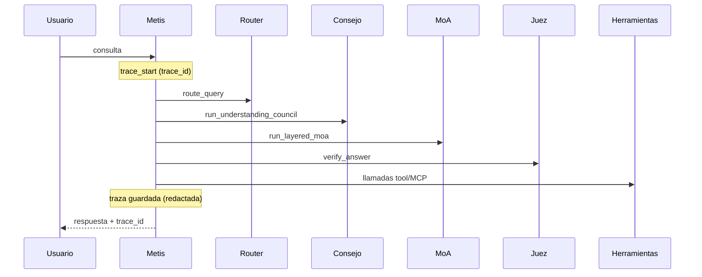

# Observabilidad

**Versión 0.1.0** — registro estructurado, trazas, detección de fallos, reintentos y auditoría.

---

## Resumen

El módulo `metis/observability/` ofrece visibilidad completa de cada solicitud sin filtrar secretos:

| Componente | Ruta | Propósito |
|------------|------|-----------|
| Registro estructurado | `logging/tracer.py` | JSON con `trace_id` y `span_id` |
| Envoltorio de módulos | `logging/module_logger.py` | Registro de cada llamada LLM |
| Auditoría | `logging/audit.py` | Eventos de seguridad sin PII |
| Eventos del pipeline | `logging/pipeline_events.py` | Etapas del ciclo de vida |
| Detección de fallos | `reliability/detector.py` | Clasificación + flag reintentable |
| Reintentos | `reliability/retry.py` | Backoff exponencial + jitter |
| Circuit breaker | `reliability/circuit_breaker.py` | Omitir endpoints no saludables |
| Almacén de trazas | `trace_store.py` | Persistencia para `metis logs trace` |

---

## Flujo de traza de solicitud



---

## Redacción de contenido (seguridad)

**Las claves API nunca se registran.** El contenido de prompts/respuestas se controla con `METIS_LOG_CONTENT`:

| Modo | Comportamiento |
|------|----------------|
| `redacted` (predeterminado) | Solo longitud + prefijo SHA-256 |
| `hash` | SHA-256 completo |
| `full` | Texto completo (solo dev) |

```bash
export METIS_LOG_CONTENT=redacted
export METIS_LOG_LEVEL=INFO
export METIS_LOG_FORMAT=json
```

---

## Política de reintentos

```yaml
reliability:
  max_retries: 3
  base_delay_ms: 500
  max_delay_ms: 30000
  retryable_errors: [timeout, rate_limit, network, model_error]
  circuit_breaker:
    enabled: true
    failure_threshold: 5
    recovery_seconds: 60
```

Las llamadas LLM de solo lectura se reintentan automáticamente (idempotentes).

---

## CLI

```bash
metis logs tail              # seguir logs estructurados
metis logs trace <uuid>      # traza completa (redactada)
metis logs stats             # tasas de fallo por módulo/endpoint
```

---

## Docker

Logs a **stdout** (JSON) para `docker logs`. Volumen `metis-logs` para auditoría:

```yaml
environment:
  METIS_LOG_FORMAT: json
  METIS_LOG_CONTENT: redacted
  METIS_AUDIT_LOG_FILE: /data/logs/audit.jsonl
volumes:
  - metis-logs:/data/logs
```

---

## Integración con economy

`trace_id` vinculado a registros de uso (`UsageMeter` → `UsageReport`).

---

## Auditoría

Eventos de seguridad en flujo separado con cadena hash opcional:

```bash
export METIS_AUDIT_HASH_CHAIN=true
```

Sin prompts, respuestas ni claves API.
