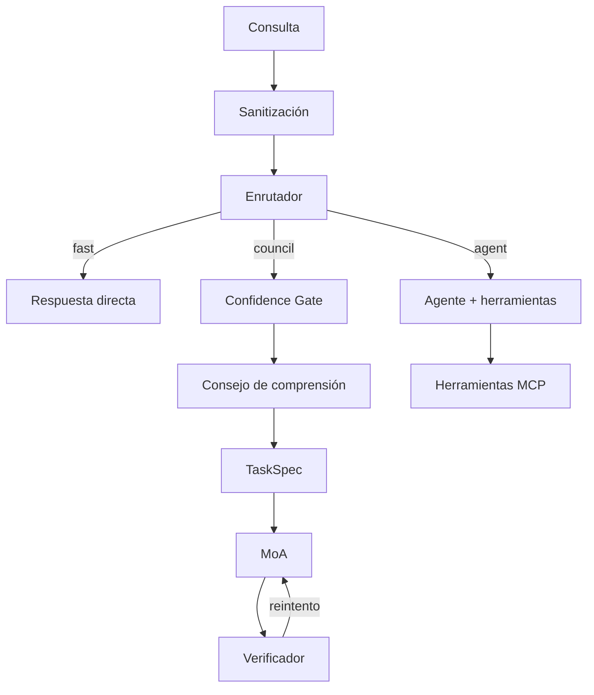
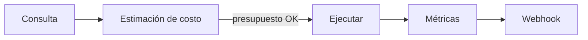
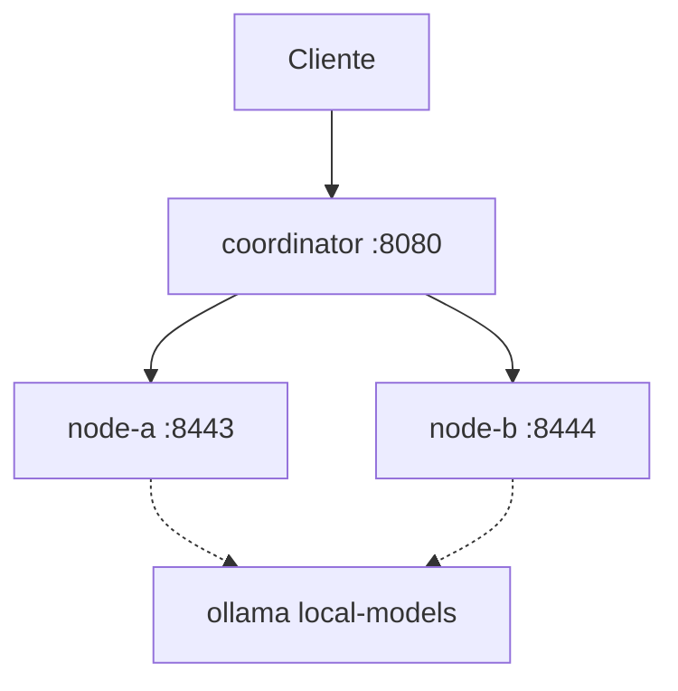

# Metis — Guía del usuario

**Orquestador de razonamiento multiagente** para cualquier LLM.

## Inicio rápido

```bash
cd metis
python3 -m venv .venv && source .venv/bin/activate
pip install -e ".[dev,distributed]"

ollama pull qwen3:8b
metis "Explica sistemas multiagente" --model qwen3:8b --url http://localhost:11434/v1
```

Documentación completa abajo · [Distribuido](DISTRIBUTED.md) · [Ecosistema](ECOSYSTEM.md)

---

## Arquitectura



## Evidencia científica

Mapeo honesto con literatura verificada. Resumen completo: [RESEARCH.md](RESEARCH.md).

| Nuestra afirmación | Qué dice la investigación | Salvedades | Cita |
|-------------------|---------------------------|------------|------|
| ≥2 modelos heterogéneos mejor que muchas copias | 2 L4 ≥ 16 L1 en 7 benchmarks | 7–8B open; vote/debate | [Yang et al., 2026](https://arxiv.org/abs/2602.03794) |
| MoA en capas mejora calidad | 65,1% vs 57,5% GPT-4o AlpacaEval 2.0 | Chat/instrucción | [Wang et al., ICLR 2025](https://arxiv.org/abs/2406.04692) |
| Escalado homogéneo se satura | Rendimientos decrecientes | 7 benchmarks | [Yang et al., 2026](https://arxiv.org/abs/2602.03794) |
| MoA heterogéneo siempre gana | **A menudo no** — Self-MoA +6,6 pp | Calidad proposer | [Li et al., 2025](https://arxiv.org/abs/2502.00674) |
| Debate ingenuo en SLM | Deriva sicofántica (~10%) | 3–8B; debate | [MMAD](https://openreview.net/forum?id=0h3dbL6Iy3) |
| Solo temperatura en un modelo | Diversidad **débil** | No equivale a otro modelo | [Yang et al., 2026](https://arxiv.org/abs/2602.03794) |

## Tamaño óptimo de la red

| Ajuste | Default | Fundamento |
|--------|---------|------------|
| Mínimo modelos únicos | **2** | Yang et al. (2026)[^scaling] |
| Roles consejo / proposers MoA | **5 / 3** | Defaults de ingeniería |
| Réplicas homogéneas | **Evitar** >2–4 | Rendimientos decrecientes[^scaling] |

[^scaling]: Yang et al., arXiv:2602.03794, 2026.

## Economía



## Seguridad

| Amenaza | Mitigación |
|---------|------------|
| Prompt injection | Sanitización, canary tokens, envoltorio `<untrusted>` |
| SSRF | Validación URL, bloqueo IP privadas |
| Acceso no autorizado | Bearer auth, fail-closed en producción |
| Replay | HMAC con ventana de 5 minutos |

## Producción

```bash
export METIS_API_KEY=sk-...
metis "consulta" -c config.production.yaml --production
```

## Docker

```bash
cp config/docker.env.example .env   # configurar secretos
docker compose up -d --build
curl http://localhost:8080/health
```



**Perfiles:** `docker compose up -d` (APIs externas) · `docker compose --profile local-models up -d` (Ollama)

**Escalado:** `docker compose up -d --scale node-a=2`

**Checklist:** claves fuertes en `.env`, TLS vía nginx, sin proveedor mock, `docker-compose.prod.yml` para límites.

## Tests

```bash
pytest -v
```

## Bibliografía

1. Yang et al. (2026). arXiv:2602.03794. https://arxiv.org/abs/2602.03794
2. Wang et al. (2025). ICLR 2025. arXiv:2406.04692. https://arxiv.org/abs/2406.04692
3. Li et al. (2025). arXiv:2502.00674. https://arxiv.org/abs/2502.00674
4. arXiv:2603.20324. https://arxiv.org/abs/2603.20324
5. MMAD. https://openreview.net/forum?id=0h3dbL6Iy3
6. Pitre et al. (2025). ACL Findings. https://doi.org/10.18653/v1/2025.findings-acl.1141
7. Yao et al. (2025). arXiv:2509.23055. https://arxiv.org/abs/2509.23055

MIT
