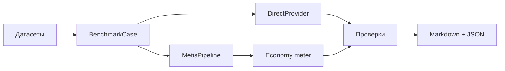

# Бенчмарки — Direct API vs Metis

Сравнение **одного прямого вызова LLM** с полным **экзоскелетом Metis** (совет понимания, confidence gate, MoA, верификатор) на одних и тех же моделях и промптах.

## Быстрый старт

```bash
cd metis
pip install -e ".[dev]"

# Офлайн (CI, mock-провайдер)
metis-benchmark run --mock --dataset simple --compare direct,metis

# DeepSeek — живое сравнение
export DEEPSEEK_API_KEY=sk-...
metis-benchmark run --models deepseek-chat --dataset all --compare direct,metis \
  --output reports/bench-$(date +%Y%m%d).md

metis-benchmark list-models
metis-benchmark list-datasets
```

## Что измеряем

| Метрика | Описание |
|---------|----------|
| **Latency (мс)** | Время на кейс |
| **Токены in/out** | Из usage API или оценка |
| **Стоимость (USD)** | Через `CostCalculator` модуля economy |
| **Число вызовов** | Direct = 1; Metis = события UsageMeter |
| **Глубина** | Оценка маршрута (fast=1 … council=12) |
| **Pass rate** | Доля пройденных проверок в датасете |

## Датасеты

| Файл | Категория | Кейсов | Задача |
|------|-----------|-------:|--------|
| `task_understanding.jsonl` | trap, ambiguous | 12 | Metis должен уточнять |
| `reasoning.jsonl` | reasoning | 12 | Проверяемая математика/логика |
| `factual.jsonl` | factual | 10 | Статические факты |
| `simple.jsonl` | simple | 10 | Тривиальные — Direct быстрее |

## Пример отчёта

| Model | Runner | Cases | Pass rate | Avg latency (ms) | Avg cost (USD) | Avg calls |
|-------|--------|------:|----------:|-----------------:|---------------:|----------:|
| deepseek-chat | direct | 44 | 82% | 890 | 0.000120 | 1.0 |
| deepseek-chat | metis | 44 | 91% | 12400 | 0.001450 | 8.2 |

## Схема прогона



## Когда Metis должен выигрывать

- **Неоднозначные / ловушки** — уточнение вместо догадок.
- **Многошаговые рассуждения** — совет и верификатор ловят ошибки.
- **Агентные задачи** — структурированный `TaskSpec`.

## Когда Direct должен выигрывать

- **Простые FAQ** — один вызов достаточен.
- **Жёсткий SLO по latency** — Metis делает несколько вызовов подряд.
- **Экономия** — прирост качества может не окупать 5–12× токенов.

## Переменные окружения

| Переменная | Провайдер |
|------------|-----------|
| `DEEPSEEK_API_KEY` | deepseek-chat |
| `OPENAI_API_KEY` | gpt-4o-mini |
| _(нет)_ | qwen3:8b через Ollama |

## CI

- `pytest -m benchmark` — mock-тесты без ключей.
- `benchmark.yml` — только ручной запуск с секретами.
