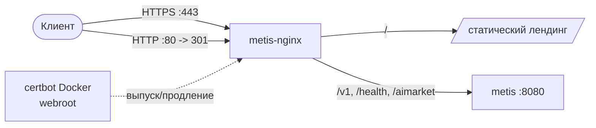

# Развёртывание Metis

**Версия 0.1.0** · Docker, production-конфигурация, секреты и масштабирование

---

## Быстрый старт

```bash
cp .env.example .env
# Задайте METIS_API_KEY, ключи провайдеров, ключи узлов

docker compose up -d --build

curl -s http://localhost:8080/health
```

Стек по умолчанию: **coordinator** + **node-a** + **node-b** на внутренней сети `metis-net`.

---

## Docker Compose

| Сервис | Роль | Порт |
|--------|------|------|
| `coordinator` | OpenAI API + маршрутизация | `8080` |
| `node-a` | Worker LLM | internal `8443` |
| `node-b` | Worker LLM | internal `8444` |
| `ollama` | Локальный inference (profile `local-models`) | internal |
| `redis` | Кэш (profile `redis`) | internal |

### Усиление безопасности контейнеров

- `read_only: true`
- `cap_drop: ALL`
- `security_opt: no-new-privileges:true`
- Non-root пользователь `metis` (uid 1000)

### Профили

```bash
docker compose --profile local-models up -d
docker compose --profile redis up -d
```

---

## Production-конфигурация

`config.production.yaml`:

- `production: true`
- `enforce_confidence_gate: true`
- `economy.session_budget_usd: 5.0`
- `security.enforce_injection_scan: true`
- `security.rate_limit`: 60 req/мин, burst 10

```bash
export METIS_CONFIG_PATH=config.production.yaml
metis-serve --production --host 0.0.0.0 --port 8080
```

---

## Управление секретами

**Никогда не коммитьте секреты в YAML.**

| Секрет | Где задать |
|--------|------------|
| `METIS_API_KEY` | `.env` |
| `METIS_NODE_A_KEY` / `METIS_NODE_B_KEY` | `.env` |
| `METIS_HMAC_SECRET` | `.env` |
| Ключи LLM-провайдеров | `.env` через `api_key_env` |

Coordinator entrypoint завершается с ошибкой, если `METIS_PRODUCTION=true` без `METIS_API_KEY`.

---

## Масштабирование

### Горизонтальное — добавление worker-узлов

1. Создайте `config/docker-node-c.yaml`
2. Добавьте сервис `node-c` в `docker-compose.yml`
3. Зарегистрируйте узел в `docker-cluster.yaml`
4. `docker compose up -d node-c`

### Контроль стоимости

```yaml
economy:
  enabled: true
  session_budget_usd: 5.0
  require_budget_for_routes: [council, agent]
```

---

## Health checks

| Цель | Endpoint | Auth |
|------|----------|------|
| Coordinator | `GET /health` | Нет |
| Worker | `GET /metis/health` | Bearer `METIS_NODE_*_KEY` |

---

## Публичный домен + HTTPS

Чтобы отдавать лендинг и API на своём домене с TLS, поставьте перед API
контейнер `nginx:alpine` и терминируйте HTTPS на нём. Готовый воспроизводимый
конфиг и пошаговые команды — в
[`deploy/nginx.conf`](../../deploy/nginx.conf) и
[`deploy/README.md`](../../deploy/README.md).



Главное:

- **DNS** — заведите `A`-запись на узел (например, `metis.modelmarket.dev`).
- **TLS** — сертификаты выпускает и продлевает **образ certbot в Docker**
  (метод webroot), пакеты на хосте не нужны (работает и на хостах с заблокированным
  apt). Еженедельный cron продлевает сертификат и перечитывает nginx автоматически.
- **Редирект** — домен всегда переводит HTTP → HTTPS; голый IP продолжает
  отдавать обычный HTTP для smoke-проверок.
- **Защита** — только TLS 1.2/1.3, HSTS и ограничение частоты запросов к API по IP.
- **Изоляция** — TLS терминирует nginx; контейнер API остаётся во внутренней
  docker-сети и наружу не публикуется.

Живой пример: **https://metis.modelmarket.dev**.

---

## Связанная документация

- [API.md](API.md) — endpoints
- [SECURITY.md](SECURITY.md) — hardening
- [DISTRIBUTED.md](DISTRIBUTED.md) — кластер

Полная английская версия: [../en/DEPLOYMENT.md](../en/DEPLOYMENT.md)
