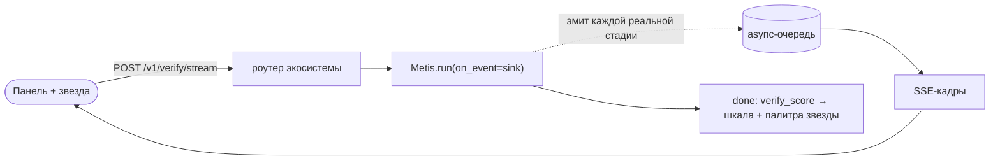
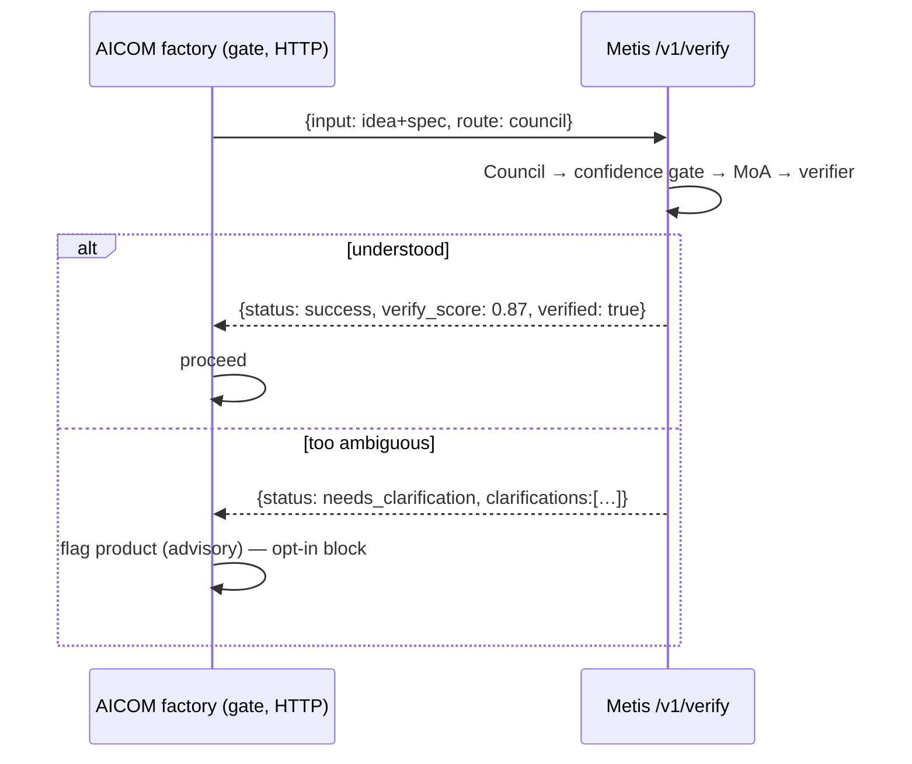

# Metis в экосистеме alexar76

**Metis** — слой **рассуждения и оркестрации**. Он находится над сырыми LLM-эндпоинтами и ниже агентов спроса вроде ARGUS. AIMarket не заменяет — возможности маркетплейса подключаются через MCP.

## Карта экосистемы

| Слой | Репозитории | Роль |
|------|-------------|------|
| **Фабрика** | `aicom`, `helios`, `aicom-landing` | Производство продуктов |
| **AIMarket** | `aimarket-protocol`, `aimarket-hub`, `aimarket-agent`, `ai-service-mesh` | Каталог, invoke, оплата |
| **Оракулы** | `oracles`, `platon`, `lottery`, `aimarket-oracle-gateway` | Верифицируемая математика |
| **Спрос** | `argus`, `dioscuri` | Референс-клиенты |
| **Капитал** | `acex`, `pulse-terminal` | Рынок агентов |
| **Визуализация** | `alien-monitor`, `aimarket-courses` | 3D-граф, обучение |
| **Рассуждение** | **`metis`** | Council, MoA, инструменты, MCP |

## Где metis в системе

Metis — **оркестратор рассуждений**:

1. **Understanding Council** → структурированный `TaskSpec`
2. **Confidence gate** → fail-closed при низкой уверенности
3. **MoA + verifier** → синтез и проверка ответа
4. **Agent loop** → встроенные инструменты + MCP из экосистемы

### Когда использовать metis

- Неоднозначные задачи, нужен контракт до решения
- Критичные ответы с верификацией и retry
- Нужны оракулы/хаб через MCP (`aimarket-oracle-gateway`)
- Распределённый кластер с разными моделями

### Когда прямой вызов модели

- Простые факты, низкие ставки → `--route fast`
- Чат с жёстким лимитом латентности

### Когда ARGUS / aimarket-agent

- Продакшен-агент с оплатой и WARDEN MCP firewall
- Telegram-интерфейс для пользователя

## Каталог MCP-серверов

| Сервер | Инструменты | Конфиг metis |
|--------|-------------|-------------------|
| **aimarket-oracle-gateway** | 35 оракулов | `mcp_ecosystem_presets: [aimarket-oracle-gateway]` |
| **aimarket-plugins** | 15 плагинов хаба | `mcp_ecosystem_presets: [aimarket-plugins]` |
| **aimarket-web** | fetch/поиск + Metis verify (SSRF-защищённый шлюз) | `mcp_ecosystem_presets: [aimarket-web]` |

Пример:

```yaml
enable_mcp_tools: true
mcp_ecosystem_presets:
  - aimarket-oracle-gateway
```

## Честная оценка улучшений

> [!IMPORTANT]
> **Metis конкурентен как верификатор и как подъём среднего движка — но не как «усилитель
> мусора».** Живые бенчмарки (см. [`docs/benchmarks/`](../benchmarks/HEAD-TO-HEAD-2026-07-11.md)):
> он поднимает средний движок до уровня фронтира (DeepSeek-V4-Pro 96% → 100%) и выдаёт сигнал
> уверенности, которого нет у голого вызова; но он **не** добавляет точности уже сильной модели
> на проверяемых задачах (только латентность), а **слабый** агрегатор может утащить совет
> *ниже* лучшей из слабых моделей. Metis чинит это автоматически — **гейт способностей**:
> самая сильная из настроенных моделей занимает кресло агрегатора/верификатора, а модели ниже
> порога лишаются голоса в совете (`metis/agents/capability.py`; баллы — из `metis calibrate`).

| Изменение | Эффект |
|-----------|--------|
| Confidence gate | **Вероятно** — ранний стоп, не гарантия корректности |
| Verifier + retry | **Вероятно** — судья тоже LLM |
| Гетерогенный MoA (≥2 модели) | **Вероятно** — не гарантия vs одна сильная модель (Li et al., 2025) |
| MCP как транспорт инструментов | **Гарантировано** для доступа к tools |
| Self-reported confidence | **Не гарантировано** — только эвристика |

## Провайдерский интерфейс — конверт верификации

Metis предоставляет свою когнитивную способность как *провайдер* экосистемы через один небольшой, опциональный маршрутизатор
(`metis/api/ecosystem.py`). Его подключение ничего больше не меняет, и Metis работает нормально без какой-либо
присутствующей экосистемы.

| Route | Caller | Body → Response |
|-------|--------|-----------------|
| `POST /v1/verify` | любой потребитель (например, шлюз фабрики AICOM) | `{input, route?, min_verify_score?}` → envelope |
| `POST /v1/verify/stream` | панель мышления на лендинге | `{input, route?}` → **SSE** живой трейс + `done` envelope |
| `POST /aimarket/invoke` | AIMarket Hub | `{input, product_id, capability_id}` → `{result: envelope}` |
| `POST /v1/chat/completions` | чат alien-monitor | OpenAI-совместимый чат |
| `GET /health` | автообнаружение потребителей | liveness + кластер + количество знаний |

**envelope** превращает «доверься одному ответу» в машиночитаемое суждение:

```json
{
  "answer": "…", "status": "success|needs_clarification|error",
  "verified": true, "verify_score": 0.87, "route": "council",
  "depth": "L3_full", "clarifications": [], "usage": {}, "trace_id": "…"
}
```

Зарегистрируйте Metis как платную, обнаруживаемую возможность хаба с помощью шаблона
`config/aimarket-capability.example.json` (установите `invoke_url` → ваш публичный `…/aimarket/invoke`, затем
`aimarket publish`). Опционально.

## Живой трейс мышления (SSE) — видно, как она думает

`POST /v1/verify/stream` выполняет **ту же** когницию, что и `/v1/verify`, но транслирует **реальные**
события пайплайна как Server-Sent Events *по мере того как они происходят*, а затем финальный кадр
`done` с полным envelope. Именно это потребляет **панель мышления** на лендинге и реагирующая звезда —
то есть вы наблюдаете настоящую делиберацию, а не анимацию.

```
event: start             data: {route_hint}
event: route_selected    data: {route}                 # маршрутизатор
event: depth_level       data: {depth}                 # DGPD-гейт глубины
event: council_started   data: {agents:[…6]}           # совет понимания
event: task_spec_created data: {confidence}            # синтезатор
event: confidence_gate   data: {action,composite_score}
event: moa_layer1/2/3    data: {attempt,skip_refiner}  # mixture-of-agents
event: self_consistency  data: {samples}
event: verify_started | verify_pass | verify_fail  data: {score,attempt}
event: escalation | tool_call | injection_blocked | budget_exceeded
event: done              data: <envelope: verify_score + usage + answer>
```

События едут на «стоке» через `ContextVar`, установленный только для запроса, который передал
`on_event=` в `Metis.run` — поэтому он достигает дочерних задач `asyncio.gather` этого запуска, не
протекает между параллельными запросами и в остальных случаях является чистым no-op (обычное
логирование). Эндпоинт отдаётся без буферизации (`X-Accel-Buffering: no`; nginx `proxy_buffering off`),
поэтому многосекундные council-прогоны приходят вживую, а не одним куском.



Звезда **реагирует** на поток: постоянное **голубое зажигание** в начале запроса, постадийные сдвиги
оттенка (фиолетовый совет, индиго MoA), **сигнал сходимости** за такт до ответа и отдельная
**палитра завершения по уверенности верификатора** — зелёно-золотое «решено» (высокая), бирюзовая
(средняя), янтарная (низкая), маджента (нужны уточнения), нейтральная голубая (fast/непроверено).
Маршрут по умолчанию остаётся быстрым; переключатель **«Deep think»** запускает полный совет для
самого богатого трейса.

Панель также показывает **разбивку времени по этапам** (стек-бар + легенда: router / council / MoA /
verify — длительности из меток времени соседних событий) и **живой индикатор соединения** — шапка
чата опрашивает `GET /health` и показывает *live · host* (зелёный), когда отвечает настоящий Metis,
иначе *demo*, — так что он никогда не утверждает, что подключён, если это не так.

## Юз-кейс: шлюз уверенности фабрики AICOM

### Какую боль он закрывает

Фабрика AICOM собирает продукты **автономно**: идея проходит через цепочку LLM-стадий
(`architect` → `methodologist` → `developer` → …) **без человека в контуре между ними**. Это порождает
один конкретный и дорогой режим отказа:

> LLM возвращает один и тот же беглый уверенный ответ независимо от того, *поняла* ли она задачу или
> *угадала*. Одно уверенно-неверное решение выше по цепочке — неправильно прочитанная спецификация,
> неоднозначная цель, молча разрешённая не в ту сторону, — не отлавливается на стадии, которая его
> приняла. Оно **накапливается через все последующие стадии** и всплывает лишь как продукт, собранный
> неправильно.

Цена такого промаха — не один плохой вызов, а **весь последующий конвейер** (минуты-часы агентского
времени и токенов) *плюс* сломанный результат, который человеку потом надо заметить, разобрать и
откатить. Голый вызов модели не даёт фабрике способа отличить «понял» от «угадал», поэтому она не может
остановиться до того, как заплатит эту цену.

### Шлюз

Для своих немногих стадий с высокими ставками фабрика маршрутизирует вход стадии через
`POST /v1/verify` **до** того, как зафиксировать его. Metis читает намерение своим советом (council),
оценивает, действительно ли оно понято (шлюз уверенности), совещается (MoA) и независимо проверяет
результат (верификатор) — возвращая **машиночитаемое суждение**, по которому фабрика может выставить
порог, а не просто ещё один ответ.



### Почему это идеальное решение — даже с учётом дополнительных секунд

Шлюз добавляет ~20–60 с к стадии, которую он покрывает (маршрут council). Эта цена оправдана — так и
задумано:

1. **Асимметрия стоимости.** Шлюз стоит секунды **один раз, заранее**. Уверенно-неверное решение стоит
   всего последующего билда плюс переделки. Отловить его на шлюзе на порядки дешевле, чем после того,
   как продукт уехал сломанным, — секунды это погрешность на фоне того, во что реально обходится плохое
   автономное решение.
2. **Он покупает сигнал, которого иначе не существует.** Как показывает наш прямой замер, на простых
   входах голая модель и так права — но она *никогда не выдаёт число уверенности*. Metis превращает
   «доверься одному беглому ответу» в `verify_score` + флаг `verified` + `clarifications`, по которым
   фабрика может действовать. Вы платите секундами за то единственное, что голый вызов дать не может.
3. **Точечно, а не поголовно.** Покрываются только немногие стадии, где быть уверенно-неверным
   катастрофично, — не каждый вызов. Дополнительная задержка ложится ровно туда, где ошибка дороже
   всего, и больше никуда.
4. **Нулевой риск внедрения.** Шлюз **опционален** и **fail-open**: если Metis медленный, упал или
   отсутствует — фабрика откатывается к работе ровно как раньше (тихий no-op). Поэтому худший случай
   дополнительных секунд ограничен — вы никогда не меняете на них надёжность самой фабрики.

**Инвариант независимости.** Фабрика общается с Metis **только по HTTP** и **автоматически обнаруживает**
его; фабрика работает без Metis, а Metis ничего не знает о фабрике (и не зависит от неё). См.
[`docs/metis-integration.md`](https://github.com/alexar76/aicom/blob/main/docs/metis-integration.md)
для представления со стороны фабрики.

## Alien-monitor

Metis появляется как узел `cognition` в мониторе экосистемы; его панель деталей показывает живые
параметры (записи знаний, узлы кластера, открытые автоматические предохранители) и **чат-бокс**, проксируемый
на стороне сервера на `/v1/chat/completions` — живой зонд в уровень рассуждений.

## Ссылки

- [Научный обзор](RESEARCH.md)
- [База знаний экосистемы](https://github.com/alexar76/aicom/blob/main/docs/ecosystem/knowledge-base-ru.md)
- [aimarket-protocol](https://github.com/alexar76/aimarket-protocol)
- [aimarket-oracle-gateway](https://github.com/alexar76/aimarket-oracle-gateway)
