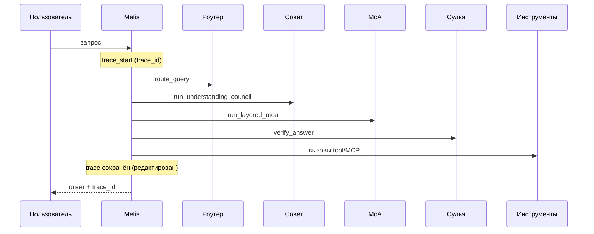

# Наблюдаемость (Observability)

**Версия 0.1.0** — структурированное логирование, трассировка, обнаружение сбоев, повторы и аудит.

---

## Обзор

Модуль `metis/observability/` обеспечивает полную видимость каждого запроса без утечки секретов:

| Компонент | Путь | Назначение |
|-----------|------|------------|
| Структурированные логи | `logging/tracer.py` | JSON с `trace_id` и `span_id` |
| Обёртка модулей | `logging/module_logger.py` | Лог каждого вызова LLM |
| Аудит | `logging/audit.py` | События безопасности без PII |
| События пайплайна | `logging/pipeline_events.py` | Этапы обработки запроса |
| Классификация сбоев | `reliability/detector.py` | Тип ошибки + флаг повтора |
| Повторы | `reliability/retry.py` | Экспоненциальная задержка + jitter |
| Circuit breaker | `reliability/circuit_breaker.py` | Пропуск нездоровых endpoint |
| Хранилище трасс | `trace_store.py` | Сохранение для `metis logs trace` |

---

## Поток трассировки запроса



---

## Редактирование контента (безопасность)

**API-ключи никогда не попадают в логи.** Контент промптов/ответов управляется `METIS_LOG_CONTENT`:

| Режим | Поведение |
|-------|-----------|
| `redacted` (по умолчанию) | Только длина + префикс SHA-256 |
| `hash` | Полный SHA-256 |
| `full` | Полный текст (только dev) |

```bash
export METIS_LOG_CONTENT=redacted
export METIS_LOG_LEVEL=INFO
export METIS_LOG_FORMAT=json
```

---

## Политика повторов

```yaml
reliability:
  max_retries: 3
  base_delay_ms: 500
  max_delay_ms: 30000
  retryable_errors: [timeout, rate_limit, network, model_error]
  circuit_breaker:
    enabled: true
    failure_threshold: 5
    recovery_seconds: 60
```

Идемпотентные (read-only) вызовы LLM повторяются автоматически. Ошибки auth и parse не повторяются.

---

## CLI

```bash
metis logs tail              # следить за логами
metis logs trace <uuid>      # полная трасса запроса (редактированная)
metis logs stats             # частота сбоев по модулям/endpoint
```

---

## Docker

Логи в **stdout** (JSON) для `docker logs`. Том `metis-logs` — для аудита:

```yaml
environment:
  METIS_LOG_FORMAT: json
  METIS_LOG_CONTENT: redacted
  METIS_AUDIT_LOG_FILE: /data/logs/audit.jsonl
volumes:
  - metis-logs:/data/logs
```

---

## Интеграция с economy

`trace_id` привязан к записям учёта использования (`UsageMeter` → `UsageReport`).

---

## Аудит

События безопасности (auth, injection, budget) — отдельный поток с опциональной hash-цепочкой:

```bash
export METIS_AUDIT_HASH_CHAIN=true
```

В аудите нет промптов, ответов и API-ключей.
