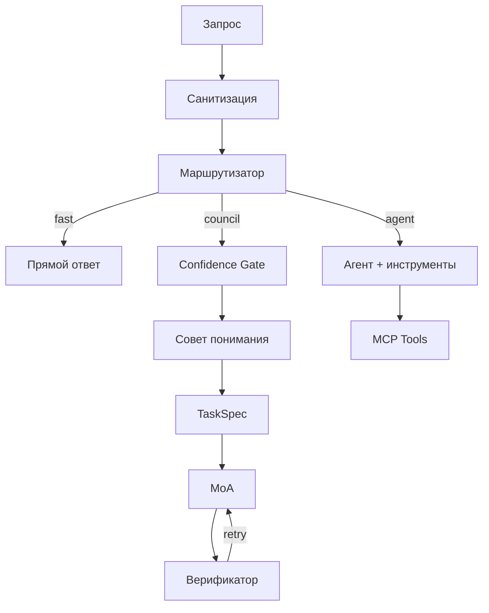

# Metis — Руководство пользователя

**Оркестратор мультиагентного рассуждения** для любой LLM.

## Быстрый старт

```bash
cd metis
python3 -m venv .venv && source .venv/bin/activate
pip install -e ".[dev,distributed]"

ollama pull qwen3:8b
metis "Объясни мультиагентные системы" --model qwen3:8b --url http://localhost:11434/v1
```

Полная документация ниже · [Научный обзор](RESEARCH.md) · [Распределённый режим](DISTRIBUTED.md) · [Экосистема](ECOSYSTEM.md)

---

## Архитектура



## Научное обоснование

Честное сопоставление архитектуры с опубликованными результатами. Полный обзор: [RESEARCH.md](RESEARCH.md).

| Наше утверждение | Что говорит исследование | Оговорки | Источник |
|------------------|--------------------------|----------|----------|
| ≥2 гетерогенные модели лучше масштабирования копий | 2 агента L4 ≥ 16 L1 на 7 бенчмарках (vote/debate) | 7–8B open; не слоистый MoA | [Yang et al., 2026](https://arxiv.org/abs/2602.03794) |
| Слоистый MoA повышает качество | 65,1% vs 57,5% GPT-4o на AlpacaEval 2.0 | Chat/instruction | [Wang et al., ICLR 2025](https://arxiv.org/abs/2406.04692) |
| Однородное масштабирование насыщается | Убывающая отдача при коррелированных выходах | 7 бенчмарков | [Yang et al., 2026](https://arxiv.org/abs/2602.03794) |
| Гетерогенный MoA всегда лучше | **Часто нет** — Self-MoA +6,6 п.п. на AlpacaEval 2.0 | Качество proposer | [Li et al., 2025](https://arxiv.org/abs/2502.00674) |
| Наивный дебат на SLM | Сикофантический дрейф (до ~10%) | 3–8B; дебат, не параллельный совет | [MMAD](https://openreview.net/forum?id=0h3dbL6Iy3) |
| Только температура на одной модели | **Слабое** разнообразие | Не эквивалент смене модели | [Yang et al., 2026](https://arxiv.org/abs/2602.03794) |

## Оптимальный размер сети

| Параметр | По умолчанию | Обоснование |
|----------|--------------|-------------|
| Минимум уникальных моделей | **2** | Yang et al. (2026)[^scaling] |
| Роли совета / proposers MoA | **5 / 3** | Инженерные default; ролевое разнообразие — слабый сигнал |
| Однородные реплики | **Избегать** >2–4 | Убывающая отдача[^scaling] |

[^scaling]: Yang et al., arXiv:2602.03794, 2026 — vote/debate, 7B–8B, не продакшен.

## Экономика


## Безопасность

| Угроза | Защита |
|--------|--------|
| Prompt injection | Санитизация, canary-токены, `<untrusted>` обёртка |
| SSRF | Валидация URL, блокировка приватных IP |
| Несанкционированный доступ | Bearer auth, fail-closed в production |
| Replay | HMAC с окном 5 минут |

## Продакшен

```bash
export METIS_API_KEY=sk-...
metis "запрос" -c config.production.yaml --production
```

## Тесты

```bash
pytest -v
```

## Библиография

1. Yang et al. (2026). arXiv:2602.03794. https://arxiv.org/abs/2602.03794
2. Wang et al. (2025). ICLR 2025. arXiv:2406.04692. https://arxiv.org/abs/2406.04692
3. Li et al. (2025). arXiv:2502.00674. https://arxiv.org/abs/2502.00674
4. arXiv:2603.20324. https://arxiv.org/abs/2603.20324
5. MMAD. https://openreview.net/forum?id=0h3dbL6Iy3
6. Pitre et al. (2025). ACL Findings. https://doi.org/10.18653/v1/2025.findings-acl.1141
7. Yao et al. (2025). arXiv:2509.23055. https://arxiv.org/abs/2509.23055

MIT
